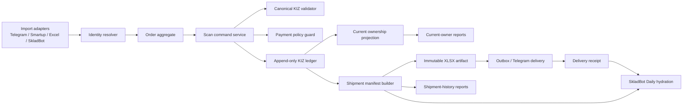
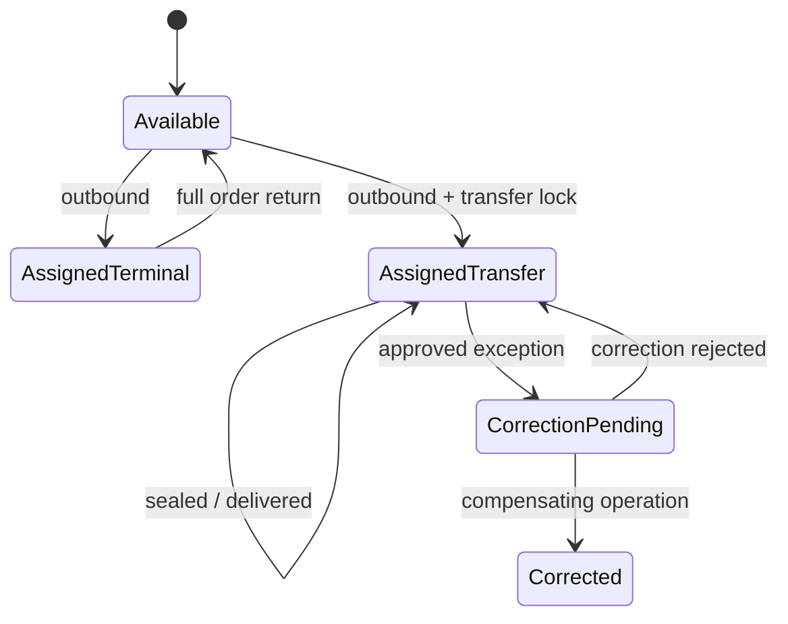
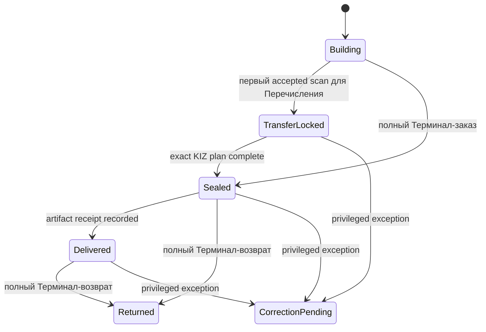

# Целостность жизненного цикла КИЗов

Дата: 2026-07-30  
Ревизия 2: 2026-07-30, после сверки требований документа с кодом; добавленные и
исправленные в ревизии пункты помечены `[R2]` и написаны без точек в конце строк  
Статус документа: `PROPOSED`  
Статус системы по требованиям этого документа: `FAIL`  
Ближайший целевой уровень: `CONTAINED` по шкале §18, порядок работ в §23  
Решения владельца от 2026-07-30 (детали в §19): необратимость наступает от seal;
исправление ошибки оператора выполняется через correction, а не через undo, return,
reset или cancel; desktop с поддержкой новых кодов ошибок выпускается раньше
backend-guard  
Область: backend, PostgreSQL, desktop/web scan flow, импорты, возвраты, отчёты КИЗов, SkladBot Daily, Telegram-доставка файлов по Перечислению  
Режим подготовки: read-only аудит production и локального кода; исправления, миграции и deploy не выполнялись

## 1. Назначение документа

Документ фиксирует:

1. подтверждённую проблему повторного использования КИЗов;
2. системные причины, из-за которых проблема возможна;
3. обязательные бизнес-правила для Терминала и Перечисления;
4. целевую архитектуру хранения КИЗов, отгрузок и юридических лиц;
5. разделение текущего состояния и неизменяемой истории;
6. требования к Daily, XLSX и Telegram-доставке;
7. безопасный план реализации, миграции, проверки и rollout;
8. критерии, после которых можно утверждать, какой КИЗ был отгружен какому юридическому лицу.

Этот документ не разрешает production-write, исправление данных, изменение
клиентских XLSX/Telegram-контрактов или deploy. Для каждого такого шага требуется
отдельное согласование.

## 2. Короткий вердикт

Сейчас система хорошо защищает КИЗ от одновременного активного назначения двум
разным заказам, но не защищает уже совершённую отгрузку от последующего
освобождения КИЗа.

Критический сценарий:

```text
КИЗ отсканирован
  -> заказ завершён или файл передан
  -> выполняется return, undo или reset
  -> КИЗ становится доступным
  -> тот же КИЗ сканируется в другой заказ
```

Поэтому одновременно верны два утверждения:

- текущий владелец КИЗа в `kiz_movements` обычно определяется однозначно;
- неизменяемая история фактической отгрузки и юридического получателя отсутствует.

Итог: по текущей модели нельзя гарантировать, что КИЗ по Перечислению никогда не
будет отменён, возвращён, освобождён или повторно отдан другому клиенту.

`[R2]` Штатные пути освобождения КИЗа в текущем коде исчерпываются четырьмя:

| Путь | Код | Что делает с КИЗом |
|---|---|---|
| `undo` | `orders_service.py:374` | удаляет скан, пишет `undo`, КИЗ свободен |
| `return` | `orders_service.py:638` | оставляет скан, пишет `return`, КИЗ свободен |
| `reset` | `order_actions_service.py:215` | удаляет сканы, пишет `reset`, КИЗ свободен |
| прямая запись в БД | вне API | движения нет, projection расходится |

Освобождающими считаются типы движений из
`AVAILABLE_FOR_OUTBOUND_MOVEMENTS = {return, undo, reset}`
(`kiz_movements_service.py:16`), проверки по `payment_type` в этих путях нет ни
одной

## 3. Подтверждённый инцидент

Спорный КИЗ безопасно обозначен как:

```text
0104006396053978217…ReVe
```

Подтверждённая системная цепочка:

1. `outbound` в первом локальном заказе получателя A;
2. полный `return`, после которого КИЗ стал доступным;
3. `re_outbound` во втором локальном заказе того же получателя;
4. заказ закрыт через `completed_without_kiz` с операторским комментарием о
   фактическом сканировании и отгрузке;
5. выполнен `undo` всех шести КИЗов второго заказа;
6. спорный КИЗ получил новое движение `outbound` в заказе получателя B по
   Перечислению.

БД подтверждает движения и системную атрибуцию заказам. Она не доказывает
физическое перемещение пачки, физический возврат или фактическое получение
товара конкретным человеком.

Отдельный пробел: перед успешным `undo` второй заказ должен был снова оказаться в
изменяемом состоянии. Полной audit-цепочки этого перехода нет, поэтому точный
механизм повторного открытия заказа не подтверждён.

`[R2]` Уточнение, меняющее вывод: текущий код не содержит ни одного штатного
пути, который вернул бы `completed`-заказ в изменяемое состояние с сохранением
строк скана:

- `undo_scan` отклоняет неактивный заказ (`orders_service.py:388`)
- `restore_order` принимает только `cancelled` и `archived_no_kiz`
  (`order_actions_service.py:305`), а `completed_without_kiz` ставит `completed`
  (`order_actions_service.py:177`)
- `reset_order_for_rescan` действительно открывает `completed`
  (`order_actions_service.py:223`), но удаляет сканы
  (`order_actions_service.py:257`), после чего `undo` вернул бы 404
- импорт статус заказа не меняет: в `imports_service.py` нет записи
  `status = not_completed`

Следовательно верна одна из двух гипотез, и обе меняют дизайн containment:

1. поведение endpoint отличалось на момент инцидента (дрейф между деплоями), тогда
   классификация истории в Фазе 4 не может опираться на текущую семантику кода;
2. запись прошла вне API (repair, psql, скрипт), тогда guard на service layer
   принципиально недостаточен, и часть DB-констрейнтов с разделением ролей
   обязана попасть в первый же change set

Проверяемо: `audit_log` по `entity_id` второго заказа, поля `action` и
`payload.web_action`; отсутствие записи при смене статуса подтверждает гипотезу 2

`[R2]` Проверка выполнена по production 2026-07-30, механизм установлен. В базе
существует ровно один заказ, чей статус не совпадает с последней audit-записью, и
это тот же заказ, в котором сделаны шесть `undo`:

| Признак | Значение |
|---|---|
| Тип оплаты | Перечисление |
| Последняя audit-запись | `order_completed_without_kiz`, 2026-07-14 09:10 UTC |
| Текущий статус | `not_completed` |
| Движения `undo` | 6, с 2026-07-24 11:05 по 11:21 UTC |
| Audit о переходе в изменяемое состояние | отсутствует |

То есть заказ был закрыт как «без КИЗов» 14 июля, затем без единой audit-записи
снова оказался активным, и 24 июля шесть его КИЗов были освобождены. Ни один
штатный путь в текущем коде такого перехода не выполняет. Гипотеза 2 подтверждена
и косвенно: 298 строк скана созданы вне `create_scan`, все из источников `google_*`
эпохи миграции. Значит containment обязан включать DB-рубеж, а не только service
layer, и это уже не предположение

## 4. Источники истины и границы вывода

| Слой | Что подтверждает | Чего не подтверждает |
|---|---|---|
| Docs | Намерение и заявленные правила | Реальное выполнение правил |
| Code | Текущую реализацию локальной ветки | Что именно развёрнуто в production |
| Tests | Проверенные программные сценарии | Операторский и физический процесс |
| Live API | Состояние runtime на момент проверки | Полную историю данных |
| PostgreSQL | Заказы, сканы, движения, события и audit | Физическую передачу товара |
| Telegram/XLSX receipt | Отправку конкретного цифрового артефакта при наличии receipt | Физическое получение товара |
| Оператор | Выполнение складского процесса | Сам по себе не заменяет ledger |
| Физические документы | Отгрузку и возврат товара | Корректность системного состояния без сверки |

Правильная формулировка текущей data truth:

> КИЗ был системно назначен локальному заказу с указанной строкой клиента.

Формулировка, которую текущая модель не позволяет доказать:

> КИЗ был юридически и физически отгружен конкретному юридическому лицу с
> указанным ИНН/ПИНФЛ.

## 5. Production baseline аудита

Read-only снимок: 2026-07-30, около 13:23 Asia/Tashkent.

| Объект | Количество |
|---|---:|
| Заказы | 3 825 |
| Позиции заказов | 9 816 |
| Строки `scan_codes` | 19 699 |
| Уникальные `kiz_codes` | 19 460 |
| Движения `kiz_movements` | 21 559 |
| Audit-записи | 439 573 |
| События `pending_events` | 63 112 |
| КИЗы с активным последним движением | 19 085 |

Положительный инвариант:

- 0 активных КИЗов без существующего заказа/позиции/скана;
- 0 несовпадений текущего владельца между последним движением и активным сканом;
- 0 переходов busy -> busy между разными заказами без промежуточного
  освобождения.

Это доказывает корректность текущего owner projection, но не неизменяемость
истории отгрузки.

`[R2]` Инвариант измерим только после фиксации определений, которых в документе
нет: «активный КИЗ», «активный скан», «текущий владелец». Пункт 6.3 сообщает про
81 строку скана, у которых последнее движение уже освобождающее, значит «активный
скан» здесь не равен «строка существует». До закрепления определений в
read-only query pack stop conditions Фазы 9 непроверяемы, а цифра 0 не является
доказательством. Определения фиксируются один раз, вместе с SQL, и переиспользуются
и в дашборде, и в приёмке

### `[R2]` Результаты прогона query pack по production

Определения зафиксированы в `backend/sql/preflight_step0_kiz_lifecycle.sql`,
прогон read-only через `vds-postgres-1`, снимок 2026-07-30 11:48 UTC.

Baseline вырос относительно §5, система живая:

| Объект | §5 (08:23 UTC) | 11:48 UTC |
|---|---:|---:|
| Заказы | 3 825 | 3 852 |
| Позиции | 9 816 | 9 881 |
| Строки `scan_codes` | 19 699 | 19 836 |
| `kiz_codes` | 19 460 | 19 597 |
| Движения | 21 559 | 21 716 |
| Audit | 439 573 | 440 468 |
| Активные КИЗы | 19 085 | 19 202 |

Что подтвердилось и с какими числами:

| Проверка | Результат | Вывод |
|---|---|---|
| КИЗ с несколькими активными владельцами | 0 | инвариант держится |
| Активное движение без строки скана | 0 | держится |
| Строки скана вне активного владения | 634, все в returned-заказах | 6.3 подтверждён, было 614 |
| Освобождающие движения по Перечислению | 628: reset 416, undo 193, return 19 | 6.1 подтверждён точно |
| Закрытые заказы с маркируемой позицией без сканов | 285 позиций в 128 заказах с флагом, 117 в 56 без флага, 8 в 4 returned | 6.6 и 6.9 подтверждены точно |
| Движения с обнулённой ссылкой на скан | 1 246, из них reset 425 из 425 и undo 196 из 196 | 6.13 подтверждён, FK уже уничтожил связь у 100% этих типов |
| Совпадения `occurred_at` внутри одного КИЗа | 0 | см. уточнение в 6.14 |
| Совпадения `scanned_at` внутри позиции | 111 групп, 325 строк | порядок строк артефакта сегодня не детерминирован |
| Расхождение счётчика и пересчёта | 7 позиций в 7 returned-заказах, суммарно 8 блоков | 6.19 подтверждён, масштаб малый |
| Невалидные canonical-коды | 1 склеенный на 71 символ с активной строкой скана, 1 короткий на 3 символа без сканов | 6.8 подтверждён |
| Distinct `payment_type` | ровно два значения: Терминал 2 668, Перечисление 1 184 | см. уточнение в 6.15 |
| `unknown` и расхождения классификаторов | 0 и 0 | текущая экспозиция нулевая |
| Строки скана без audit-записи | 298, последняя 2026-07-16, все из источников `google_*` | запись вне API подтверждена, но это эпоха миграции, а не текущий поток |
| Заказы со статусом, не совпадающим с последним audit | 1 | см. уточнение в §3 |
| Права runtime-роли | superuser, `rolbypassrls`, UPDATE/DELETE/TRUNCATE на всех таблицах | см. 6.26 |
| Transfer-заказы без разрешимого ключа клиента | 68 из 1 184, то есть 5,7% | см. уточнение в 7.4 |
| Варианты написания одного клиента | 3 ключа по 2 варианта, отличия в кавычках и точке | 6.7 подтверждён, масштаб малый |
| Ключи, различающиеся только латинскими гомоглифами | 0 | риск теоретический |

## 6. Полный реестр подтверждённых проблем

### 6.1. Перечисление можно изменить после отгрузки

В штатных путях `undo`, `return`, `reset`, cancel, delete и
`completed_without_kiz` нет единого fail-closed правила по `payment_type`.

Production содержит:

- 4 возвращённых заказа по Перечислению;
- 19 движений `return` по ним;
- 14 заказов по Перечислению с 193 движениями `undo`;
- 1 заказ по Перечислению с 416 движениями `reset`;
- 4 заказа по Перечислению, закрытых через `completed_without_kiz`.

Текущее административное уведомление об undo после передачи файла является
только detective-контролем. Оно не блокирует операцию и не возвращает состояние
автоматически.

Связанный код:

- `backend/app/orders_service.py` — scan, undo и return;
- `backend/app/order_actions_service.py` — reset/rescan;
- `backend/app/transfer_kiz_service.py` — readiness и alert;
- `backend/app/telegram_transfer_kiz_processor.py` — формирование и отправка файла.

### 6.2. Повторное использование возможно не только после возврата

В `scan_codes` обнаружено:

- 508 групп повторяющихся кодов;
- 1 050 строк в этих группах;
- 501 код встречается в разных заказах и у разных клиентов.

У всех текущих duplicate-групп есть возврат где-то в истории, но полная
последовательность показывает дополнительные пути освобождения:

- 7 межзаказных повторных назначений после `undo`;
- 4 межзаказных повторных назначения после `reset`;
- 124 последовательности `undo -> outbound`;
- 185 последовательностей `reset -> outbound`.

Следовательно, правило «дубль возможен только после полного возврата» сейчас не
обеспечено.

### 6.3. `scan_codes` одновременно используется как projection и история

`scan_codes` является изменяемой таблицей:

- возврат может оставить старую строку;
- undo/reset может удалить строку;
- новый outbound создаёт новую строку для другого заказа.

Из-за этого отчёт, читающий `scan_codes`, не может быть одновременно:

- точным текущим остатком;
- полной историей отгрузок;
- доказательством юридического получателя.

В production:

- 614 строк сканов относятся к возвращённым заказам;
- 533 из них содержат КИЗы, уже назначенные другим заказам;
- 81 строка относится к КИЗам, последнее движение которых уже освобождающее;
- исторические назначения, удалённые через undo/reset, отсутствуют в текущем
  отчёте.

### 6.4. Отправленный XLSX не имеет неизменяемого манифеста

Событие доставки файла по Перечислению хранит source/import metadata и время
завершения, но не хранит достаточное доказательство отправленного содержимого:

- SHA-256 выходного XLSX;
- размер файла;
- количество строк;
- количество КИЗов;
- canonical manifest строк;
- версию шаблона и генератора;
- Telegram `message_id`;
- Telegram `file_id`;
- точное время построения артефакта;
- legal entity snapshot.

Текущий файл можно реконструировать из сегодняшнего состояния БД, но это не
доказывает, что именно такие байты и строки были отправлены ранее.

### 6.5. Daily может считаться полным при неоднозначной связи

Daily связывает заявку и локальный заказ по canonical-паре:

```text
SkladBot request ID + WH-R/WR number
```

При нескольких локальных владельцах одной пары КИЗы остаются пустыми, но
неоднозначность не всегда блокирует coverage.

Подтверждены две collision-группы, включая два локальных заказа с одной парой
идентификаторов в инциденте.

В результате:

- scheduled coverage может стать `complete`;
- строка КИЗов может быть пустой;
- заявка может быть помечена reported;
- поздняя реконструкция Daily даёт другой набор строк.

Изменение числа реконструируемых строк после отправки подтверждено для отчётов
22–28 июля.

### 6.6. Завершённые заказы продолжают изменяться импортом

Текущий active-order predicate для импорта исключает returned, но не все закрытые
статусы.

Если источник присылает новую позицию с новым item key, она может быть добавлена
в уже завершённый заказ.

Production содержит:

- 3 маркируемые позиции в 2 completed-заказах, созданные после завершения;
- 402 маркируемые позиции в 184 completed-заказах без единого скана;
- 285 позиций в 128 заказах с явным forced completion;
- 117 позиций в 56 заказах без подтверждённого разрешения пропустить КИЗ.

Такой заказ уже может быть отправлен в Daily, хотя его фактический состав
изменился позже.

### 6.7. Юридическое лицо не является стабильной сущностью

В `orders` хранятся:

- свободный текст `client`;
- `payment_type`;
- source/raw payload.

Не хранятся обязательные доказательные поля:

- `legal_entity_id`;
- ИНН/ПИНФЛ;
- тип юридического субъекта;
- source system + immutable external counterparty ID;
- legal name snapshot на момент отгрузки;
- ссылка legal entity в `kiz_movements`.

Дополнительные проблемы:

- варианты написания одного клиента создают разные строки;
- не у всех заказов есть полная SkladBot-пара;
- часть активных КИЗов не имеет полной canonical-пары;
- request number сам по себе не является юридическим идентификатором.

### 6.8. Backend не гарантирует canonical-формат во всех writer paths

Нормальная desktop/browser проверка строже части backend/repair путей.

В production обнаружены:

- активный compound-code, содержащий два КИЗа в одной строке;
- отдельный registry code длиной 3 символа;
- позиция, где plan равен 2 блокам, но сохранено 3 строки скана.

Проверка должна выполняться на backend до любой записи, независимо от источника:

- web;
- desktop;
- offline replay;
- Telegram/import;
- repair/admin;
- migration/backfill.

### 6.9. Full-return contract не равен доказанной полноте КИЗов

Штатный API требует подтверждение полного набора видимых позиций. Частичный
item-level возврат не найден.

Но production data содержит:

- 29 из 190 returned-заказов, где количество сохранённых КИЗов не совпадает с
  подтверждённым количеством блоков;
- 8 маркируемых позиций в 4 returned-заказах без строк скана;
- 1 returned-заказ без ожидаемой audit-записи.

Это не доказывает физический частичный возврат, но не позволяет доказать полный
возврат конкретного набора КИЗов.

### 6.10. Локальный `main` и live backend различаются

Локальная `main` содержит дополнительные защиты конкурентного сканирования и
полностью отсканированной позиции, которых нет в зафиксированном live commit.

В частности, live может вернуть существующий scan как успешный ответ, когда в
уже заполненную позицию прислали другой новый КИЗ. Для stale/offline клиента это
может выглядеть как успешная синхронизация, хотя новый код не сохранён.

Локальные тесты не являются доказательством поведения live до deploy и
операторской приёмки.

### 6.11. `[R2]` `completed_without_kiz` не проверяет наличие сканов

`cancel` и `archive_without_kiz` проходят через `ensure_order_has_no_scans`
(`order_actions_service.py:392`), а массовое закрытие без КИЗов такой проверки не
имеет: `validate_complete_without_kiz_order` проверяет только активность заказа и
`expected_updated_at` (`order_actions_service.py:489`)

Следствия:

- полностью или частично отсканированный заказ закрывается как «без КИЗов», сканы
  и движения остаются, отчёт и Daily считают его отгруженным;
- это же объясняет часть аномалий 6.6 (117 позиций в 56 заказах без
  подтверждённого разрешения пропустить КИЗ);
- закрывается одной проверкой, миграция не нужна

### 6.12. `[R2]` `reset` штатно открывает закрытый заказ

`reset_order_for_rescan` отклоняет только `returned`
(`order_actions_service.py:223`), поэтому `completed`, `done`, `closed`,
`cancelled` и `archived_no_kiz` возвращаются в `not_completed` с удалением всех
строк скана и записью `reset` по каждому коду. Это самый дешёвый и самый широкий
путь освобождения уже отгруженного КИЗа, и в исходном реестре он не выделен как
отдельный дефект

### 6.13. `[R2]` Append-only ledger нарушен семантикой внешних ключей

`kiz_movements` объявлен так (`models.py:153-157`):

- `kiz_id` с `ondelete=CASCADE`;
- `order_id`, `order_item_id`, `scan_code_id` с `ondelete=SET NULL`

Практические последствия уже наступили:

- `undo_scan` пишет движение со ссылкой на скан и в той же транзакции удаляет этот
  скан (`orders_service.py:430`), поэтому `scan_code_id` в только что созданной
  записи обнуляется;
- `reset` делает то же самое по всем сканам заказа (`order_actions_service.py:257`);
- `delete_active_order` выполняет `db.delete(order)` (`order_actions_service.py:102`),
  каскад удаляет позиции и сканы, а движения теряют привязку к заказу и позиции;
- удаление строки `kiz_codes` удалит всю историю движений этого КИЗа

Запрет `UPDATE`/`DELETE` для runtime-роли (§14.2) эту мутацию не останавливает:
её выполняет сам PostgreSQL по описанию FK. Требуется снимок идентификаторов в
неизменяемых колонках без FK либо перевод ссылок в `RESTRICT`, плюс запрет
физического удаления заказа при наличии движений

### 6.14. `[R2]` Порядок движений не задан правилом, детерминированный SHA недостижим

`latest_kiz_movement` и `lookup_kiz_state` сортируют
`occurred_at DESC, id DESC` (`kiz_movements_service.py:91`,
`kiz_movements_service.py:106`), где `id` это случайный UUID v4
(`models.py:152`). Совпадение `occurred_at` не исключение, а норма: `reset`
записывает все движения одним `now` (`order_actions_service.py:229`), `return`
одним `returned_at` (`orders_service.py:655`)

Формулировка уточнена после независимой сверки: при совпадении метки времени
порядок произволен, но после записи стабилен, поэтому один и тот же запрос не будет
давать разные ответы. Реальный ущерб в другом:

- при совпадении времени выбирается семантически неверная вершина, и это уже
  реализуемо на legacy-дублях одного кода, где движения разных заказов совпали по
  времени batch-операции;
- бизнес-порядка нет вообще: `occurred_at` для скана приходит с клиента
  (`orders_service.py:299`), значит offline-replay может записать движения с
  временем, не совпадающим с фактическим порядком принятия;
- детерминированность артефакта недостижима: строки отчёта сортируются по
  `(scanned_at, str(id))` (`kiz_reports_service.py:203`), где `id` случаен, поэтому
  при равных `scanned_at` порядок строк XLSX меняется между сборками, и требование
  §18.7 «тот же manifest даёт тот же SHA» не выполнимо в принципе

`previous_movement_id` из §9.7 задаёт связь, но не порядок. Нужен монотонный
`BIGINT` sequence на движение, уникальность `(kiz_id, movement_seq)`, стабильный
`ordinal` в manifest, и правило: projection, история и порядок строк артефакта
строятся только по ним

`[R2]` Замер по production 2026-07-30 разделил этот пункт на два разных по остроте:

- совпадений `occurred_at` внутри одного КИЗа: **0**. Значит текущая projection
  владельца фактически детерминирована, и риск неверной вершины пока теоретический.
  Аргумент за `movement_seq` остаётся, но он про гарантию воспроизводимости backfill
  и про отсутствие бизнес-порядка, а не про наблюдаемую поломку;
- совпадений `scanned_at` внутри одной позиции: **111 групп, 325 строк**. Здесь
  дефект наблюдаемый: порядок этих строк в XLSX решается случайным UUID
  (`kiz_reports_service.py:203`), поэтому требование §18.7 «тот же manifest даёт тот
  же SHA» сегодня не выполняется. Стабильный `ordinal` обязателен, и он важнее
  `movement_seq` по срочности

### 6.15. `[R2]` Политика оплаты висит на substring-классификаторе свободного текста

`payment_type` это `String(120)` из колонки «Тип оплаты» (`models.py:47`,
`imports_service.py:32`). Классификация выполняется двумя расходящимися функциями:

- `payment_group` (`reports_service.py:550`) принимает `терминал`, `terminal`,
  `перечис`, `безнал`, `transfer`;
- `normalize_payment_type` (`skladbot_contracts.py:161`) латинские варианты не
  принимает

Обе возвращают `unknown`, и сейчас `unknown` трактуется как «не Перечисление»
(`transfer_kiz_service.py:203`), то есть fail-open. Любая опечатка в источнике
снимет необратимость, а ложное срабатывание в обратную сторону заблокирует
Терминал-заказ. Требуется один resolver, `unknown` как blocker для seal и для
release, и подсчёт distinct `payment_type` в production до включения guard

`[R2]` Замер выполнен 2026-07-30: в production ровно два значения `payment_type`,
`Терминал` в 2 668 заказах и `Перечисление` в 1 184, `unknown` ноль, расхождений
классификаторов ноль. То есть дефект реален в коде, но текущая экспозиция нулевая:
источник пока присылает канонические значения. Вывод: resolver и fail-closed нужны
как защита от будущего значения, приоритет ниже, чем у guard-ов освобождения КИЗа, а
gate шага 1 «unknown равен нулю» уже выполнен

### 6.16. `[R2]` Desktop классифицирует конфликты по подстрокам сообщений

Развёрнутый desktop определяет неретраибельный конфликт сравнением подстрок
английского текста ответа (`src/taksklad/backend_events.py:245`), отдельно
распознаёт идемпотентный повтор скана
(`src/taksklad/backend_events.py:238`)

Любой новый guard, возвращающий 409 с новым текстом, для уже установленных
бинарников будет retryable: offline-очередь начнёт бесконечный повтор, оператор
увидит зависшую синхронизацию, а не понятную ошибку. Стабильные коды из §11.1
проблему не решают, пока их не понимает клиент. Требуется матрица совместимости
сообщений, порядок релиза «desktop раньше backend» либо сохранение узнаваемого
маркера в тексте новых ошибок, и контрактный тест на эту матрицу; образец парности
backend и desktop уже есть в `tests/test_kiz_blocklist.py`

### 6.17. `[R2]` Существующий blocklist не учтён как рычаг containment

`backend/app/kiz_blocklist.py` блокирует конкретные коды маркировки на входе в
скан (`orders_service.py:176`, `orders_service.py:214`) и настраивается через
`TAKSKLAD_BLOCKED_KIZ_CODES`. Это единственный уже работающий и уже развёрнутый
механизм точечного запрета, он отсутствует и в реестре проблем, и в списке
связанных файлов §21

Два следствия:

- containment спорных кодов можно включить сегодня, без миграций и без нового кода;
- в модуле полный код маркировки зашит в исходник и попал в git, что противоречит
  правилу 7.1.10 этого же документа; список должен переехать в конфигурацию или
  таблицу, а фрагмент кода в §3 нужно сверить с уже заблокированным, они различаются

### 6.18. `[R2]` Порядок блокировок инвертирован, deadlock достижим

Разные команды берут те же ресурсы в разном порядке:

| Команда | Порядок захвата |
|---|---|
| `complete_order` | `orders` FOR UPDATE (`orders_service.py:538`), затем UPDATE `order_items` (`orders_service.py:579`) |
| `undo_scan` | `order_items` FOR UPDATE (`orders_service.py:384`), advisory KIZ (`orders_service.py:391`), затем UPDATE `orders` (`orders_service.py:443`) |
| `mark_order_returned` | `orders` FOR UPDATE (`orders_service.py:644`), затем advisory KIZ (`orders_service.py:691`) |
| `reset_order_for_rescan` | `orders` FOR UPDATE, затем позиции, advisory-лока по коду нет вообще (`order_actions_service.py:241`) |

Сценарии отказа:

- `complete_order` держит заказ и ждёт позицию, `undo_scan` держит позицию и ждёт
  заказ, PostgreSQL снимает одну транзакцию по `deadlock detected`;
- `mark_order_returned` держит заказ и ждёт advisory-лок кода, `undo_scan` держит
  advisory-лок и ждёт заказ, тот же результат;
- для оператора это 500 и повторная попытка, для offline-очереди повтор события

Требуется единый протокол: `orders` → `order_items` в отсортированном порядке →
advisory-локи КИЗов в отсортированном порядке, и добавление advisory-лока в `reset`.
Это обязательное условие до расширения транзакции shipment-строками, иначе новые
блокировки только увеличат вероятность deadlock

`[R2]` Статус: не аналитический вывод, а воспроизведённый дефект. Тест
`tests/test_postgres_kiz_lock_order.py`, запуск
`./tools/run_postgres_tests.sh kiz-lock-order`, PostgreSQL 16.14, оба сценария дают
`SQLSTATE 40P01 deadlock detected`:

| Сценарий | Кого снимает PostgreSQL |
|---|---|
| `complete_order` против `undo_scan` | `complete_order` |
| `mark_order_returned` против `undo_scan` | `undo_scan` |

Для оператора это HTTP 500 при штатном действии на двух рабочих станциях, а для
offline-очереди повтор события. Тест помечен `expectedFailure` и снимает пометку
после шага 4

### 6.19. `[R2]` Завершение заказа доверяет денормализованному счётчику

`complete_order` определяет неполные позиции по `item.scanned_blocks <
item.quantity_blocks` (`orders_service.py:550`), не пересчитывая строки сканов, тогда
как отчёт считает объём заново через `scanned_blocks_for_scans`
(`kiz_reports_service.py:305`)

При расхождении счётчика и фактических строк заказ закрывается как полный, а отчёт
показывает другое количество. Это независимый источник аномалий из 6.6 и 6.9, и он
не закрывается ни одним правилом §7 в исходной редакции. Требование: полнота
проверяется пересчётом по ledger, счётчик остаётся кэшем

### 6.20. `[R2]` Aggregate box ломает наивный подсчёт manifest

Один код агрегированной коробки означает 50 блоков:
`AGGREGATE_BOX_BLOCK_QUANTITY = 50` (`scan_quantities.py:3`),
`block_quantity_for_code` (`scan_quantities.py:67`), в XLSX это одна строка с
количеством блоков 50 (`kiz_reports_service.py:203`)

Поэтому ограничение из §9.5 «число КИЗов совпадает с планом позиции» неверно и
заблокирует штатную приёмку коробок. Manifest обязан хранить и проверять два разных
числа: количество canonical-кодов и количество бизнес-блоков, а инвариант
формулируется как «сумма `block_quantity` кодов manifest равна плану позиции»

### 6.21. `[R2]` Полный КИЗ уже пишется в audit, а не только в blocklist

`AuditLog` при скане и при undo содержит поле `code` с полным кодом маркировки
(`orders_service.py:344`, `orders_service.py:451`). При 439 573 audit-записях это
основной, а не краевой канал раскрытия. Правило 7.1.10 требует перехода на
fingerprint во всех новых записях и отдельного решения владельца по существующим

### 6.22. `[R2]` Outbox дедуплицирует по ключу без сверки содержимого

`queue_outbox_event` по умолчанию идёт с `strict_identity=False`
(`outbox_service.py:90`), при конфликте по `idempotency_key` возвращает
существующее событие и не сравнивает payload (`outbox_service.py:120`). Строгая
проверка включена только в двух местах (`skladbot_return_requests.py:100`,
`skladbot_request_dry_run.py:603`), доставка Transfer-файла её не использует

Ключ доставки строится из `import_id` и `source_file`
(`transfer_kiz_service.py:158`), поэтому при изменившемся составе заказа повторная
постановка вернёт старое событие, и клиенту уйдёт артефакт по устаревшему состоянию.
Для артефактов ключ обязан включать `shipment_id` и `manifest_sha256`, а вызов
обязан идти со `strict_identity=True`

### 6.23. `[R2]` Правила количества дублируются в backend и desktop

`backend/app/scan_quantities.py` и `src/taksklad/scan_quantities.py` содержат
собственные копии префиксов агрегированных коробок и константы 50. Изменение только
на сервере даёт другой локальный счётчик у оператора и другой смысл replay-payload.
Любое изменение canonical-правил обязано выпускаться парой с контрактным тестом
парности, как это уже сделано для blocklist (`tests/test_kiz_blocklist.py`)

### 6.24. `[R2]` Daily тихо пропускает неоднозначную пару

`_exact_owner_by_pair` отдаёт владельца только при единственности
(`skladbot_daily_kiz.py:202`), после чего заявка просто пропускается в цикле
построения строк (`skladbot_daily_kiz.py:123`). Ни ошибки, ни предупреждения нет,
расчёт coverage о пропуске не знает. Это механизм, из-за которого выполняется
сценарий 6.5: отчёт уходит как полный, строка КИЗов пустая

### 6.26. `[R2]` Runtime-роль БД является superuser

Замер по production 2026-07-30: приложение подключается ролью, у которой
`rolsuper = true`, `rolbypassrls = true`, и полный набор прав
`SELECT, INSERT, UPDATE, DELETE, TRUNCATE, REFERENCES, TRIGGER` на `orders`,
`order_items`, `scan_codes`, `kiz_codes`, `kiz_movements`, `audit_log`. Других
логинящихся ролей в кластере нет.

Последствия, которые меняют план:

- пункт §14.2 «runtime DB-role без UPDATE/DELETE ledger» сейчас нарушен максимально:
  никакого разделения нет вообще;
- триггер append-only, предложенный в §14.2, superuser отключает, поэтому сам по
  себе он не является рубежом; сначала нужна отдельная роль приложения без права
  снимать триггеры и без `BYPASSRLS`, и только потом триггер обретает смысл;
- любой скрипт, взявший те же креды, имеет полный доступ на удаление, что и
  подтверждается историей: 298 строк скана вне API и 425 движений `reset`, часть из
  которых с источником `manual_repair`;
- разделение ролей это отдельный шаг с перезапуском контейнеров и сменой креды в env
  на сервере, то есть операция, требующая согласования и окна

### 6.25. `[R2]` Alembic downgrade не является rollback

Ключевые миграции объявлены forward-only: baseline
(`backend/migrations/versions/20260616_0001_baseline.py:170`), data invariants
(`20260710_0010_data_invariants.py:111`), atomic outbox
(`20260710_0011_atomic_outbox.py:79`)

Значит план обязан опираться только на expand-only схему и rollback кодом или
feature flag, а раздел «migration downgrade там, где безопасно» из Фазы 3 не должен
создавать иллюзию обратимости. Записи, сделанные новой версией, остаются после
возврата старого бинарника и требуют reconciliation

## 7. Обязательные бизнес-правила

Ниже приведён целевой контракт. Реализация считается неправильной, если хотя бы
одно правило можно обойти через другой endpoint, worker, repair script или
прямой ORM path.

### 7.1. Общие правила КИЗов

1. Один canonical КИЗ имеет не более одного активного владельца.
2. Любое изменение владельца оформляется append-only движением.
3. Исторические движения не обновляются и не удаляются.
4. `scan_codes` не является источником исторических отчётов.
5. Все writer paths используют одну canonical-нормализацию и валидацию.
6. Повтор одного и того же idempotency key возвращает первоначальный результат.
7. Новый другой КИЗ в полностью отсканированную позицию всегда получает conflict.
8. Изменение completed/sealed заказа обычным импортом запрещено.
9. Исправление ошибки выполняется отдельной correction operation, а не
   удалением истории.
10. В логах и метриках полный КИЗ не раскрывается.
11. `[R2]` Порядок движений задаётся монотонным серверным sequence, а не временем
    события; текущий владелец и любая история строятся только по нему
12. `[R2]` Ссылки движения на заказ, позицию, скан и shipment неизменяемы: удаление
    или каскад не имеют права обнулять или удалять запись ledger
13. `[R2]` Политика оплаты вычисляется одним resolver; нераспознанное значение это
    blocker операции, а не «не Перечисление»
14. `[R2]` Новый отказ, который может увидеть desktop или web, обязан быть
    распознаваемым уже развёрнутым клиентом; иначе изменение выпускается только
    вместе с клиентом и контрактным тестом на совместимость

### 7.2. Терминал

1. Заказ может быть возвращён только целиком.
2. Полный возврат принимает exact shipment manifest, а не текущий список строк
   `scan_codes`.
3. Все КИЗы manifest освобождаются в одной транзакции.
4. Если хотя бы один КИЗ manifest отсутствует, принадлежит другому shipment или
   уже освобождён, операция целиком отклоняется.
5. После полного возврата КИЗ может быть назначен новому заказу через
   `re_outbound`.
6. Частичный item/KIZ return обычным API запрещён.

### 7.3. Перечисление

`[R2]` Утверждено владельцем 2026-07-30: необратимость наступает от seal, исправление
ошибки идёт через correction. Исходная редакция делала заказ необратимым с первого
принятого скана, это строже бизнес-факта и создаёт операторский тупик: доказательная
ценность возникает в момент seal и отправки файла, а до этого идёт обычная сборка,
где опечатка сканера штатна. Правила разделены на два уровня, и на обоих исправление
оформляется записью correction, различается только уровень утверждения.

Уровень 1, сборка (`building`), до seal:

1. Исправление выполняется командой correction типа `pre_seal_undo`: обязательны
   автор из аутентифицированного контекста, причина из справочника и append-only
   движение; отдельное утверждение не требуется, потому что отгрузки ещё нет
2. Действие ограничено тем же заказом; освобождённый КИЗ получает `pending_recheck`
   и до seal либо до конца смены принимается только в этот же заказ
3. Запрещены `return`, `reset`, `cancel`, `delete`, `completed_without_kiz` и любое
   изменение состава заказа
4. Каждая correction уровня 1 увеличивает счётчик аномалий заказа; превышение порога
   блокирует seal и требует операторской сверки
5. Требование утверждения и на уровне 1 включается флагом
   `correction_approval_required_before_seal`, по умолчанию выключен: иначе каждая
   опечатка сканера остановит сборку до появления администратора

Уровень 2, после seal или отправки файла (`sealed`, `delivered`):

1. Состояние необратимо
2. Запрещены:
   - undo;
   - return;
   - reset/rescan;
   - cancel;
   - delete;
   - изменение состава заказа;
   - `completed_without_kiz`;
   - повторное использование его КИЗов.
3. Единственный путь исправления это correction case с утверждением; guard уровня 2 и
   correction обязаны выпускаться одним change set, релиз guard без correction
   запрещён
4. Роли берутся из существующей RBAC-матрицы (`access_policy.py:39`): создаёт
   correction обладатель `warehouse:write`, утверждает обладатель `admin:write`;
   новая роль `transfer_correction_approver` на первом шаге не вводится
5. После полного сканирования создаётся и seal-ится immutable shipment manifest.

Общие правила Перечисления:

1. XLSX строится только из sealed manifest.
2. Ошибка оператора после seal исправляется только через отдельный correction case с
   причиной, автором, утверждением и новой компенсирующей записью.
3. Correction case не должен молча освобождать КИЗ или переписывать ранее
   отправленный артефакт.
4. Файл, manifest и Telegram receipt сохраняются как единое доказательство.
5. `[R2]` Нераспознанный `payment_type` блокирует seal и release, а не наследует
   правила Терминала

### 7.4. Юридическое лицо

`[R2]` Требование «нет legal entity, нет seal» опасно тем, что останавливает
клиентскую доставку: `tax_id` и стабильный идентификатор контрагента отсутствуют в
модели данных полностью, authoritative source не выбран (§19.1). Правило вводится
ступенями.

`[R2]` Замер по production 2026-07-30 уточняет масштаб и снимает первоначальное
преувеличение. Утверждение «seal не прошёл бы ни один Transfer-заказ» неверно:
из 1 184 Transfer-заказов 68, то есть 5,7%, не имеют разрешимого ключа клиента по
существующей нормализации, у 5 нет полной пары SkladBot, различных ключей клиента
424. Все 68 приходятся на статус `completed`, среди активных и returned таких нет.
Значит ступень A закрывает вопрос почти полностью, а даже жёсткое правило ступени B
заблокировало бы 68 исторических заказов, а не весь поток. Промежуточный ключ на
`client_points.normalized_client` рабочий

Ступень A, действует сразу:

1. Shipment хранит `legal_entity_ref` (нормализованный ключ клиента) и
   `legal_entity_confidence` из набора `verified`, `reconstructed`, `ambiguous`
2. Seal выполняется при любом confidence, значение попадает в snapshot
3. Промежуточным нормализованным ключом выступает существующий
   `client_points.normalized_client` (`models.py:443`), новых сущностей не требуется
4. Отчёты и дашборд показывают долю shipment с confidence ниже `verified`

Ступень B, после утверждения authoritative source и появления resolver:

1. Каждый shipment обязан ссылаться на стабильный `legal_entity_id`.
2. Для Перечисления без подтверждённого legal entity shipment не seal-ится.
3. На момент seal сохраняется snapshot:
   - ИНН/ПИНФЛ или другой утверждённый юридический ключ;
   - полное юридическое наименование;
   - source system;
   - external counterparty ID;
   - версия/время разрешения identity.
4. Переименование клиента позже не меняет старый shipment.
5. Alias используется только для поиска, но не как доказательный идентификатор.

## 8. Целевая архитектура

### 8.1. Основной принцип

Необходимо разделить три разных понятия:

| Понятие | Источник | Назначение |
|---|---|---|
| История | Append-only ledger + sealed shipment | Что происходило |
| Текущее состояние | Current ownership projection | Где КИЗ числится сейчас |
| Цифровое доказательство | Artifact + manifest + delivery receipt | Что было сформировано и отправлено |

`scan_codes` остаётся совместимой операционной проекцией на переходный период,
но перестаёт быть источником исторической истины.

### 8.2. Компоненты



### 8.3. Граница одной транзакции

Принятый scan должен атомарно выполнять:

1. lock заказа/позиции;
2. canonical validation КИЗа;
3. lock KIZ identity;
4. проверку current owner;
5. проверку payment policy и статуса shipment;
6. append нового движения;
7. обновление current ownership projection;
8. обновление счётчика позиции;
9. создание audit entry;
10. создание outbox event при достижении готовности.

Если любой пункт не выполнен, транзакция откатывается целиком.

Внешняя Telegram-отправка выполняется после commit через outbox. Состояние
shipment и manifest не зависит от успешности сети.

`[R2]` Текущее состояние и обязательный протокол блокировок.

Реализовано уже сегодня: `create_scan` в одной транзакции выполняет lock позиции,
advisory-лок кода, проверку владельца, append движения, обновление счётчика, audit и
постановку outbox-события (`orders_service.py:222-357`). Не реализовано: блокировка
самого заказа, отдельная ownership projection, проверка payment policy и shipment.
Значит §8.3 это не переписывание транзакции, а её достройка.

Единый порядок захвата, обязательный для всех команд (см. 6.18):

1. `orders` FOR UPDATE
2. `order_items` FOR UPDATE в порядке возрастания `id`
3. advisory-локи КИЗов в порядке возрастания ключа лока
4. строки shipment и ownership projection

Любая команда, которая берёт ресурсы в другом порядке, считается дефектом
независимо от результата тестов

## 9. Целевая модель данных

Названия таблиц являются предложением и могут быть уточнены в отдельной
миграционной спецификации.

### 9.1. `legal_entities`

| Поле | Назначение |
|---|---|
| `id` | Внутренний стабильный UUID |
| `entity_type` | legal/person/sole proprietor по утверждённой модели |
| `tax_id` | Нормализованный ИНН/ПИНФЛ, если применимо |
| `canonical_name` | Актуальное canonical-наименование |
| `source_system` | Smartup/SkladBot/manual/другой источник |
| `source_external_id` | Стабильный ID контрагента в источнике |
| `status` | active/blocked/needs_review |
| `created_at`, `updated_at` | Audit timestamps |

Ограничения:

- уникальность `(source_system, source_external_id)`;
- уникальность нормализованного `tax_id`, если бизнес подтвердит правило;
- отсутствие автоматического merge только по похожему имени.

### 9.2. `order_identity_links`

Хранит source identities отдельно от свободного `raw_payload`.

| Поле | Назначение |
|---|---|
| `order_id` | Локальный заказ |
| `source_system` | SkladBot/Smartup/Telegram file |
| `external_request_id` | Source ID |
| `external_request_number` | WH-R/WR номер |
| `source_revision` | Версия/редакция источника |
| `linked_at` | Время привязки |

Для одной canonical source-пары допускается только один активный order revision.
Collision должен блокировать Daily и shipment seal.

### 9.3. `shipments`

| Поле | Назначение |
|---|---|
| `id` | Immutable shipment UUID |
| `order_id` | Локальный заказ |
| `legal_entity_id` | Юридический получатель |
| `payment_policy` | terminal/transfer |
| `status` | building/transfer_locked/sealed/delivered/returned/correction_pending |
| `source_identity_snapshot` | Immutable JSON source IDs |
| `legal_entity_snapshot` | Immutable JSON юридических данных |
| `manifest_version` | Версия контракта manifest |
| `manifest_sha256` | Хеш canonical manifest |
| `sealed_at`, `sealed_by` | Кто и когда seal-ил |
| `delivered_at` | Время подтверждённой цифровой доставки |

После `sealed` изменяемые бизнес-поля запрещены.

### 9.4. `shipment_items`

Immutable snapshot состава:

- shipment;
- исходный `order_item_id`;
- canonical product ID;
- product name snapshot;
- planned blocks/pieces;
- requires KIZ;
- source item identity.

### 9.5. `shipment_kiz`

| Поле | Назначение |
|---|---|
| `shipment_id` | Shipment |
| `shipment_item_id` | Позиция manifest |
| `kiz_id` | Canonical KIZ |
| `assignment_movement_id` | Движение назначения |
| `ordinal` | Стабильный порядок строки |
| `assigned_at` | Время принятия |

Ограничения:

- один КИЗ не повторяется внутри manifest;
- ~~число КИЗов совпадает с планом позиции~~ `[R2]` заменено на два независимых
  числа, см. 6.20: сумма `block_quantity` кодов manifest равна плану позиции в
  блоках, а количество canonical-кодов хранится отдельно и с планом не сравнивается;
- `[R2]` `ordinal` присваивается монотонно при принятии и задаёт единственный
  порядок строк артефакта;
- после seal строки не изменяются.

### 9.6. `kiz_current_ownership`

Транзакционная projection для быстрых проверок:

- `kiz_id`;
- `order_id`;
- `order_item_id`;
- `shipment_id`;
- `movement_id`;
- `ownership_state`;
- `assigned_at`;
- `released_at`.

Partial unique constraint гарантирует только одного активного владельца.

`[R2]` Уточнения, без которых констрейнт не встанет:

- вид индекса: `UNIQUE (kiz_id) WHERE ownership_state = 'active'`
- сегодня единственность владельца обеспечивается только advisory-локом
  (`kiz_movements_service.py:24`) и проверкой последнего движения, DB-гарантии нет;
  `reset` при этом код не локирует (`order_actions_service.py:241`)
- в `scan_codes` нет уникальности по `code` (`models.py:114`), а в production
  508 duplicate-групп, поэтому любой unique-констрейнт по коду ставится только
  после классификации и разведения этих групп
- обработчик `IntegrityError` в `create_scan` (`orders_service.py:359`) сейчас
  рассчитан на констрейнт, которого нет; после его появления путь надо перепроверить

### 9.7. Расширение `kiz_movements`

Добавить:

- `[R2]` `movement_seq` типа `BIGINT` из серверной последовательности, уникальный
  в паре `(kiz_id, movement_seq)`, единственный источник порядка;
- `shipment_id`;
- `legal_entity_id`;
- `business_operation_id`;
- `reason_code`;
- `correction_case_id`;
- `idempotency_key`;
- `previous_movement_id`;
- `source_event_id`;
- actor type/actor ID;
- schema version.

Ledger должен быть append-only. UPDATE/DELETE для runtime-роли запрещаются.

`[R2]` Дополнительно к запрету для роли требуется убрать FK-мутации, описанные в
6.13:

- `order_id`, `order_item_id`, `scan_code_id`, `kiz_id` хранятся как неизменяемые
  колонки без `ON DELETE SET NULL` и без `CASCADE`;
- ссылочная целостность обеспечивается `RESTRICT` либо снимком идентификатора плюс
  проверкой в приложении;
- физическое удаление заказа запрещается при наличии движений: `delete_active_order`
  (`order_actions_service.py:51`) переводится в архивный статус без `db.delete`;
- `undo` и `reset` перестают удалять строку скана: строка помечается неактивной,
  чтобы ссылка движения оставалась валидной, а projection считалась по ledger;
- триггер запрещает `UPDATE` и `DELETE` на таблице движений независимо от роли

### 9.8. `shipment_artifacts`

| Поле | Назначение |
|---|---|
| `shipment_id` или `shipment_batch_id` | Владелец артефакта |
| `artifact_type` | transfer_kiz_xlsx/daily_xlsx |
| `contract_version` | Версия клиентского контракта |
| `filename` | Фактическое имя |
| `sha256` | SHA-256 точных байтов |
| `size_bytes` | Размер |
| `row_count` | Число data rows |
| `kiz_count` | Число уникальных КИЗов |
| `manifest_sha256` | Связь с canonical manifest |
| `storage_ref` | Контролируемое хранилище |
| `built_at` | Время создания |

### 9.9. `delivery_receipts`

Хранит результат внешней доставки:

- artifact ID;
- channel;
- destination reference без raw secret;
- Telegram `message_id`;
- Telegram `file_id`;
- sent filename;
- sent_at;
- response status;
- idempotency key;
- ambiguous delivery flag;
- retry/correction reference.

### 9.10. `correction_cases`

Исключительный путь для ошибки после необратимой операции:

- неизменяемая ссылка на исходный shipment;
- причина из утверждённого справочника;
- запросивший actor;
- утвердивший actor;
- набор компенсирующих движений;
- цифровые/операторские доказательства;
- статус расследования.

Correction не должен удалять исходное движение или исходный artifact.

## 10. Машина состояний

### 10.1. КИЗ



Запрещённые переходы:

- `AssignedTransfer -> Available` через обычный undo/return/reset;
- `AssignedTransfer -> AssignedTerminal`;
- `AssignedTransfer -> другой shipment`;
- любое освобождение без движения и correction reference.

### 10.2. Shipment



Для `payment_policy=transfer` переход в `Returned` запрещён.

`[R2]` Где живут состояния:

- `building`, `transfer_locked`, `sealed`, `delivered`, `returned`,
  `correction_pending` это состояния shipment и хранятся только в
  `shipments.status`
- `orders.status` не расширяется. Причина: значение ограничено CheckConstraint
  `ck_orders_supported_status` (`models.py:30`), участвует в partial index
  `idx_orders_active_page` (`models.py:21`), в наборах `COMPLETED_STATUSES` и
  `INACTIVE_ORDER_STATUSES` (`order_statuses.py:9`), в `active_order_predicate`
  (`imports_service.py:602`), в desktop и web фильтрах. Добавление сюда
  `transfer_locked` меняет поведение всех этих мест разом и не откатывается флагом
- необратимость заказа выводится из состояния его shipment, отдельного статуса на
  заказе не появляется
- `[R2]` состояние КИЗа получает промежуточное `PendingRecheck` для уровня 1 из
  7.3: КИЗ освобождён внутри того же заказа, но недоступен другим заказам до конца
  смены либо до seal

## 11. Командные пути и API-контракты

Новые routes и client-facing сообщения требуют отдельного approval.

### 11.1. Scan

Предлагаемый command:

```text
AcceptKizScan(
  order_id,
  order_item_id,
  raw_code,
  source,
  workstation_id,
  actor,
  idempotency_key
)
```

Результат обязан содержать:

- canonical code fingerprint;
- order/item/shipment IDs;
- movement ID;
- accepted/idempotent/conflict status;
- current scanned/required counts;
- payment policy state.

Обязательные стабильные error codes:

- `kiz_format_invalid`;
- `kiz_already_owned`;
- `order_item_fully_scanned_new_code`;
- `order_closed`;
- `transfer_order_irreversible`;
- `legal_entity_unresolved`;
- `shipment_manifest_mismatch`.

### 11.2. Full return

```text
ReturnWholeShipment(
  shipment_id,
  expected_manifest_sha256,
  actor,
  reason,
  idempotency_key
)
```

Операция:

1. разрешена только для Терминала;
2. lock-ит shipment и все KIZ ownership rows;
3. сверяет exact manifest;
4. освобождает все КИЗы;
5. не допускает частичный commit;
6. создаёт один business operation и N связанных движений.

### 11.3. Transfer correction

Обычные endpoints не получают override flag.

Отдельный restricted command:

```text
OpenTransferCorrectionCase(...)
ApproveTransferCorrectionCase(...)
ExecuteTransferCompensation(...)
```

Нельзя реализовывать correction как `force=true` в существующем undo.

`[R2]` Два типа по решению от 2026-07-30:

```text
OpenCorrection(order_id, kind=pre_seal_undo|post_seal_correction, kiz, reason_code,
               actor, idempotency_key)
ApproveCorrection(correction_id, approver)     # обязателен только для post_seal
ExecuteCorrection(correction_id)
```

- `pre_seal_undo`: разрешён только для shipment в состоянии `building`, только в
  границах того же заказа, утверждение не требуется, освобождённый код переходит в
  `pending_recheck`
- `post_seal_correction`: требует `admin:write`, не удаляет исходное движение и
  исходный артефакт, создаёт компенсирующую запись и оставляет shipment в истории
- desktop получает оба типа как машинные коды до включения guard на backend

### 11.4. Lineage lookup

Административный read-only endpoint:

```text
GET /api/v1/kiz/{code}/lineage
```

Должен показывать:

- canonical identity;
- текущее состояние;
- полный movement ledger;
- shipment;
- local order;
- source request;
- юридическое лицо и snapshot;
- artifact и delivery receipt;
- return/correction references;
- уровень доказательства physical truth.

## 12. Отчётная архитектура

### 12.1. Два разных отчёта

Нельзя объединять в одном неразмеченном наборе:

1. `Shipment history` — что было seal-нуто/отправлено;
2. `Current KIZ ownership` — где КИЗ числится сейчас.

#### Shipment history

Источник:

- sealed shipment;
- shipment items;
- shipment KIZ;
- legal entity snapshot;
- artifact/receipt.

Строки не меняются после возврата или correction. Новые события добавляют
отдельный статус/движение.

#### Current ownership

Источник:

- `kiz_current_ownership`;
- последнее ledger movement.

Возвращённые и свободные КИЗы не показываются как активная отгрузка.

### 12.2. Daily

Daily должен:

1. связывать заявку только через уникальный `order_identity_link`;
2. читать КИЗы из sealed/current shipment в соответствии с утверждённым
   клиентским контрактом;
3. блокировать scheduled send при ambiguity;
4. блокировать send при маркируемой позиции без exact KIZ coverage;
5. строить immutable report snapshot;
6. сохранять hash/manifest/row counts;
7. сохранять receipt доставки;
8. не менять отправленный snapshot при последующих изменениях данных.

### 12.3. Изменение XLSX/Telegram

До реализации требуется отдельный exact before/after:

- filenames;
- sheet names;
- columns;
- captions;
- Telegram text;
- message types;
- recovery messages.

Изменения Telegram routing/error требуют:

- synthetic contract tests;
- no-send verifier;
- отдельного approval.

## 13. Импорт и идентичность заказа

### 13.1. Закрытый заказ неизменяем

Импорт обязан fail closed по статусу заказа:

- completed;
- done;
- closed;
- returned;
- archived_no_kiz;
- cancelled.

`[R2]` Отдельно, по состоянию shipment (в `orders.status` эти значения не
попадают, см. 10.2):

- transfer_locked;
- sealed;
- delivered.

`[R2]` Сейчас `active_order_predicate` (`imports_service.py:602`) исключает только
`returned`, поэтому расширение предиката это минимальное и самое дешёвое
изменение из всего документа: одна функция, один тест, без миграции. Оно же
закрывает 6.6

Если источник присылает новую версию:

1. совпадающий immutable payload считается idempotent;
2. изменённый payload создаёт `source revision conflict`;
3. после решения владельца создаётся новый order revision или correction case;
4. существующий закрытый order не изменяется.

### 13.2. Разрешение юридического лица

Порядок доверия:

1. утверждённый source external counterparty ID;
2. ИНН/ПИНФЛ;
3. заранее утверждённый alias mapping;
4. manual review.

Запрещено автоматически объединять клиентов только по:

- похожему имени;
- адресу;
- телефону;
- заявке;
- товару.

## 14. Защита на нескольких уровнях

### 14.1. Application layer

Один `KizLifecyclePolicy` используется всеми командами:

- scan;
- undo;
- return;
- reset;
- cancel;
- delete;
- import mutation;
- forced completion;
- report seal;
- correction.

Запрещено копировать правила в разные routers без общего сервиса.

`[R2]` Фактическая карта writer paths на 2026-07-30, проверена по коду:

| Что пишется | Кто пишет | Вывод |
|---|---|---|
| `kiz_movements` через runtime API | `orders_service.py`, `order_actions_service.py` | всего два модуля, единая policy достижима малой правкой |
| `scan_codes` через runtime API | только `orders_service.py` | единственная точка создания скана в приложении |
| `scan_codes` и `kiz_movements` напрямую | `tools/google_cutover_active_kiz_repair.py:647`, `tools/google_cutover_repair.py:1378` | конструируют `ScanCode(...)` и `KizMovement(...)` в обход `create_scan`, значит policy на service layer их не покрывает |
| удаление скана | `orders_service.py:430`, `order_actions_service.py:257` | две точки, обе обязаны стать неудаляющими |
| удаление заказа | `order_actions_service.py:102` | единственный `db.delete(order)` |
| мутация заказов и позиций | `imports_service.py:199`, `excel_web_service.py`, `smartup_auto_import.py`, `telegram_import_processor.py`, `admin_service.py`, `reconciliation_service.py`, `tools/reconcile_chapman_orders.py`, `tools/repair_telegram_logistics_orders.py` | движений не пишут, но меняют состав и статусы, поэтому policy обязана покрывать мутацию order/item |

Следствия для §16:

- writer registry обязан включать repair-инструменты, иначе критерий §7 «правило
  нельзя обойти» остаётся необеспеченным: скрипт создаст второй активный скан без
  advisory-лока и без DB-рубежа, потому что уникальности по `code` в `scan_codes`
  нет (`models.py:114`);
- это же независимо подтверждает гипотезу 2 из §3: путь записи вне API существует
  и уже применялся при google cutover;
- объём Фазы 1 в исходной редакции всё же завышен по другой причине: Telegram и
  Smartup воркеры пишут заказы и позиции, но не движения, поэтому их покрытие
  сводится к guard закрытых заказов, а не к полной lifecycle policy

### 14.2. Database layer

Минимальные fail-closed механизмы:

- unique canonical KIZ;
- partial unique current ownership;
- immutable sealed shipment;
- append-only movements;
- FK shipment -> legal entity;
- unique active source identity pair;
- check количества manifest KIZ;
- runtime DB-role без UPDATE/DELETE ledger.

Application guard остаётся нужен для понятной ошибки, DB constraint — последний
рубеж.

`[R2]` Разделение по стоимости и срокам, потому что §3 допускает запись вне API:

Ставится сразу, без предварительной чистки данных:

- триггер, запрещающий `UPDATE` и `DELETE` на `kiz_movements`;
- отдельная runtime DB-роль без права мутации ledger, ревизия того, у кого
  есть DB write помимо приложения;
- снятие `ON DELETE SET NULL` и `CASCADE` со ссылок движения (6.13);
- `movement_seq` с уникальностью `(kiz_id, movement_seq)`

Ставится только после классификации исторических данных:

- unique canonical KIZ и partial unique current ownership: блокируются 508
  duplicate-группами;
- check количества manifest KIZ: блокируется 29 расхождениями по возвратам;
- FK shipment на legal entity: блокируется отсутствием authoritative source, до
  ступени B из 7.4 колонка остаётся nullable

### 14.3. Queue/outbox layer

В одной транзакции с seal:

- сохраняется manifest;
- сохраняется artifact build request;
- создаётся idempotent outbox event.

Worker не пересобирает manifest из изменяемых текущих таблиц.

Если доставка имеет неоднозначный результат:

- событие становится `manual_recovery_required`;
- автоматическая повторная отправка блокируется;
- исходный artifact/hash сохраняется;
- оператор сверяет receipt.

## 15. Observability и постоянные инварианты

Нужны read-only проверки:

| Инвариант | Ожидаемое значение |
|---|---:|
| КИЗ с несколькими активными владельцами | 0 |
| Активный owner без latest busy movement | 0 |
| Latest busy movement без current owner | 0 |
| Transfer shipment с release movement | 0 |
| Sealed shipment без legal entity | 0 |
| Sealed shipment с KIZ count mismatch | 0 |
| Delivered artifact без SHA/receipt | 0 |
| Completed shipment с маркируемой позицией без KIZ | 0 |
| Неоднозначная source pair в scheduled Daily | 0 |
| Изменение sealed manifest | 0 |
| Невалидный canonical KIZ | 0 |
| `[R2]` Движения с обнулённой ссылкой на заказ, позицию или скан | 0 |
| `[R2]` КИЗы с двумя движениями с одинаковым `movement_seq` | 0 |
| `[R2]` Заказы, где `scanned_blocks` расходится с пересчётом по сканам | 0 |
| `[R2]` Активные заказы с нераспознанным `payment_type` | 0 |
| `[R2]` События доставки, переиспользованные с другим manifest | 0 |
| `[R2]` Строки manifest, где сумма `block_quantity` не равна плану позиции | 0 |

Предлагаемые метрики:

- `kiz_active_owner_conflicts_total`;
- `kiz_transfer_forbidden_attempts_total`;
- `kiz_manifest_mismatch_total`;
- `kiz_invalid_format_total`;
- `shipment_legal_entity_unresolved_total`;
- `shipment_artifact_missing_receipt_total`;
- `daily_kiz_ambiguity_total`;
- `closed_order_import_conflicts_total`.

Полные КИЗы, персональные данные, Telegram token/chat ID в метрики и логи не
попадают.

## 16. План реализации

`[R2]` Порядок исполнения задан в §23. Фазы ниже сохраняются как детальный backlog
работ и verifier-ов, но их последовательность переопределена: payment resolver и
совместимый desktop уходят вперёд, необратимость привязывается к seal, а часть
DB-рубежей переносится в первый change set.

### Фаза 0. Утверждение контракта и containment

Цель: остановить расширение дефекта до крупной миграции.

Работы:

1. утвердить бизнес-инварианты этого документа;
2. определить authoritative legal entity source;
3. определить correction policy для ошибки по Перечислению;
4. подготовить exact before/after для client-facing изменений;
5. добавить feature flags для новых write guards и report readers;
6. подготовить read-only invariant dashboard/query pack;
7. ~~временно блокировать все штатные release-операции для Перечисления на
   service layer~~ `[R2]` заменено: блокировать release-операции по Перечислению
   только после seal или отправки файла, одновременно с минимальным correction, и
   точечно закрывать спорные коды существующим blocklist
   (`backend/app/kiz_blocklist.py`, `TAKSKLAD_BLOCKED_KIZ_CODES`), который работает
   уже сегодня и не требует ни миграции, ни релиза desktop
8. `[R2]` зафиксировать SQL-определения инвариантов и терминов «активный КИЗ»,
   «активный скан», «текущий владелец» (см. §5), дальше пользоваться только ими
9. `[R2]` подготовить матрицу совместимости ошибок с развёрнутым desktop (6.16) и
   выбрать порядок релиза
10. `[R2]` записать ответ на вопрос «что делает оператор при ошибочном скане
    сегодня и что будет делать после guard», без него guard не выпускается

Проверки:

- существующий test suite;
- новые failing contract tests;
- no-send synthetic flow;
- отсутствие изменения output-контрактов.

Stop condition:

- нет утверждённого юридического идентификатора;
- неизвестно, как обрабатывать ошибочно принятый Transfer-КИЗ;
- guard ломает активную offline-очередь desktop.

Rollback:

- только feature flag к старому коду;
- никаких data rewrites.

### Фаза 1. Единая policy layer

Цель: закрыть обходы через разные endpoints.

Предполагаемые области:

- `backend/app/orders_service.py`;
- `backend/app/order_actions_service.py`;
- import services;
- admin/repair services;
- Telegram/Smartup workers.

Работы:

1. реализовать `KizLifecyclePolicy`;
2. запретить Transfer undo/return/reset/cancel/delete/force complete;
3. запретить mutation закрытых заказов;
4. унифицировать stable error codes;
5. привязать actor к authenticated context;
6. исключить raw override flags.

Verifier:

- unit matrix каждого command path;
- PostgreSQL integration tests;
- desktop offline replay tests;
- web synthetic tests;
- concurrency tests.

Stop condition:

- хотя бы один writer path обходит policy;
- desktop трактует conflict как success;
- изменение client-facing сообщения не согласовано.

### Фаза 2. Canonical KIZ validation

Цель: запретить новые невалидные коды.

Работы:

1. единый normalizer/validator;
2. одинаковая проверка во всех источниках;
3. quarantine вместо автоматического исправления ambiguous compound codes;
4. fingerprint для безопасных логов;
5. fixture corpus: GS separator, ASCII, aggregate box, пробелы, Unicode,
   compound scans, короткие коды.

Verifier:

- property-based tests;
- legacy fixture tests;
- PostgreSQL writer tests;
- offline replay;
- repair path tests.

Data correction существующих невалидных кодов в эту фазу не входит.

### Фаза 3. Expand schema

Цель: добавить новую модель без переключения production reads.

Работы:

1. добавить `legal_entities`;
2. добавить `order_identity_links`;
3. добавить shipments/items/KIZ;
4. добавить current ownership projection;
5. расширить movement ledger;
6. добавить artifacts/receipts/correction cases;
7. добавить constraints и индексы сначала в безопасном режиме;
8. включить dual-write под feature flag.

Миграционная безопасность:

- expand-only;
- online/index concurrently, где применимо;
- без удаления старых колонок;
- без массового table lock в рабочее время;
- restore point и проверенный rollback кода.

Verifier:

- migration upgrade на production-size clone;
- migration downgrade там, где безопасно;
- query plans;
- lock-time measurements;
- dual-write parity.

### Фаза 4. Исторический backfill без выдумывания

Цель: построить новую историю с явным уровнем доверия.

Каждый reconstructed shipment получает confidence:

- `verified` — есть однозначные ledger/source/artifact данные;
- `reconstructed` — однозначно восстановлено из нескольких источников;
- `ambiguous` — конфликт или отсутствует доказательство;
- `physical_unverified` — системная цепочка известна, физический факт нет.

Работы:

1. восстановить shipment из order/items/movements/import metadata;
2. связать source identities;
3. разрешить legal entity только по утверждённым ключам;
4. не merge-ить free-text aliases автоматически;
5. классифицировать 508 duplicate-групп;
6. классифицировать Transfer returns/undo/reset;
7. классифицировать completed-without-KIZ;
8. вынести спорный инцидент и malformed KIZ в manual review queue;
9. сравнить current projection с последним movement.

Запрещено:

- переписывать старые движения;
- удалять старые scan rows;
- автоматически назначать юрлицо по похожему имени;
- объявлять physical truth без документов.

Verifier:

- 100% row accounting;
- before/after reconciliation;
- повторный backfill даёт тот же результат;
- shadow queries без production mutation.

### Фаза 5. Immutable shipment и Transfer seal

Цель: сделать новую отгрузку доказательной.

Работы:

1. создавать shipment при первом accepted scan;
2. для Transfer атомарно включать irreversible lock;
3. seal-ить exact manifest при готовности;
4. строить XLSX из manifest;
5. сохранять bytes/hash/counts/version;
6. отправлять через idempotent outbox;
7. сохранять Telegram receipt;
8. блокировать повторную сборку из изменяемых данных.

Verifier:

- deterministic artifact test;
- одинаковый manifest -> одинаковый SHA;
- retries отправляют тот же artifact;
- ambiguous send не вызывает автоматический дубль;
- post-seal mutation отклоняется на service и DB layers.

### Фаза 6. Full-return для Терминала

Цель: гарантировать только полный атомарный возврат.

Работы:

1. возвращать shipment по manifest SHA;
2. проверять весь набор КИЗов до первой записи;
3. создавать один business operation;
4. append N return movements;
5. освобождать все current owners;
6. отклонять частичный или конфликтный набор;
7. запретить путь для Transfer.

Verifier:

- full return success;
- missing one KIZ -> полный rollback;
- duplicated KIZ -> полный rollback;
- concurrent rescan -> один победитель;
- retry с тем же idempotency key;
- Transfer -> deterministic conflict.

### Фаза 7. Отчёты и Daily

Цель: разделить историю и текущее состояние.

Работы:

1. shipment-history reader;
2. current-owner reader;
3. убрать raw `scan_codes` из исторического отчёта;
4. Daily hydration через unique identity link;
5. ambiguity/missing coverage становятся blockers;
6. сохранять report snapshot/hash/receipt;
7. shadow compare со старым отчётом;
8. подготовить согласованный client-facing before/after.

Verifier:

- golden XLSX tests;
- column/caption/filename contract tests;
- no-send Telegram tests;
- same-day rebuild сохраняет original artifact;
- returned shipment остаётся в истории, но исчезает из current owner;
- duplicate old scan row не создаёт вторую shipment-history строку.

### Фаза 8. Production anomaly reconciliation

Выполняется только после отдельного разрешения на data write.

Очередь:

1. спорная цепочка шести КИЗов;
2. 4 Transfer returns;
3. 14 Transfer orders с undo;
4. Transfer reset;
5. 4 Transfer forced completions;
6. 29 return quantity mismatches;
7. returned-позиции без КИЗов;
8. 117 silent completed positions без КИЗов;
9. 508 duplicate report groups;
10. malformed compound KIZ и короткий registry code;
11. source-pair collisions;
12. audit gaps и неклассифицируемые deleted orders.

Для каждой записи:

- system evidence;
- operator evidence;
- physical evidence;
- legal identity;
- принятое решение;
- compensating movement;
- actor/approver;
- before/after invariant result.

Никаких прямых UPDATE/DELETE без correction operation.

### Фаза 9. Rollout

Порядок:

1. локальный full verifier;
2. independent review;
3. migration rehearsal на production-size clone;
4. no-send shadow deploy;
5. dual-write с чтением старой модели;
6. parity monitoring;
7. новый current-owner reader;
8. новый shipment-history reader;
9. согласованный Daily/XLSX contract;
10. ограниченный production rollout;
11. реальная desktop/web/scanner acceptance;
12. наблюдение минимум один полный отчётный цикл;
13. отключение legacy writers;
14. legacy reads остаются доступными для rollback window;
15. удаление legacy paths отдельным поздним изменением.

Stop conditions:

- любой active owner conflict;
- любое разрешённое Transfer release;
- manifest/hash mismatch;
- missing legal entity в новом Transfer shipment;
- Daily send при ambiguity;
- unexpected Telegram send;
- desktop lost/offline event;
- `/ready` degraded;
- невозможен безопасный rollback.

Rollback:

- выключить новые read paths;
- остановить новый consumer;
- сохранить уже записанный append-only ledger;
- не удалять новую историю;
- вернуться к предыдущему binary/image;
- провести reconciliation событий, принятых во время dual-write.

## 17. Полная тестовая матрица

### Scan

- первый валидный КИЗ;
- idempotent повтор того же КИЗа;
- другой КИЗ в полной позиции;
- один КИЗ одновременно в двух позициях;
- два workstation;
- web и desktop одновременно;
- offline replay после завершения;
- aggregate box;
- malformed/compound/Unicode;
- actor spoofing;
- retry после timeout.

### Перечисление

- первый scan включает irreversible lock;
- undo блокируется;
- return блокируется;
- reset блокируется;
- cancel/delete блокируются;
- forced completion блокируется;
- поздний import блокируется;
- seal без legal entity блокируется;
- artifact deterministic;
- delivery retry сохраняет тот же SHA;
- ambiguous send требует manual recovery.

### Терминал

- полный возврат;
- частичный список;
- неверный manifest hash;
- отсутствующий КИЗ;
- уже освобождённый КИЗ;
- concurrent return/rescan;
- повтор return request;
- повторная выдача после полного возврата.

### Imports

- idempotent exact revision;
- новая позиция в open order;
- новая позиция в completed order;
- новая позиция в transfer_locked order;
- source pair collision;
- legal entity unresolved;
- legal entity alias collision.

### Reports/Daily

- immutable history после return;
- current owner после return;
- current owner после разрешённого Terminal re-outbound;
- duplicate legacy scan rows;
- ambiguous request pair;
- missing KIZ coverage;
- source repair после отправки;
- same-day rebuild;
- report artifact hash/receipt;
- manual partial/no-send contract.

### Migrations

- empty DB;
- production-size clone;
- legacy duplicate data;
- malformed codes;
- interrupted backfill;
- repeated backfill;
- dual-write parity;
- rollback code with expanded schema.

### `[R2]` Регрессии ревизии 2

Порядок и целостность ledger:

- два движения с одинаковым `occurred_at` дают детерминированный порядок по
  `movement_seq`;
- повторный расчёт projection на тех же данных даёт тот же результат;
- `undo` не обнуляет `scan_code_id` созданного движения;
- попытка удалить заказ с движениями отклоняется;
- `UPDATE` и `DELETE` на `kiz_movements` отклоняются триггером, а не только ролью

Guard закрытых заказов:

- `reset` для `completed`, `done`, `closed`, `cancelled`, `archived_no_kiz`
  отклоняется;
- `completed_without_kiz` для заказа со сканами отклоняется;
- импорт новой позиции в закрытый заказ отклоняется и не создаёт позицию;
- импорт того же payload остаётся идемпотентным

Политика оплаты:

- `терминал`, `Терминал`, `terminal`, `перечисление`, `Перечисление`, `безнал`,
  `transfer` классифицируются одинаково двумя вызовами одного resolver;
- пустое значение и опечатка дают `unknown`, seal и release блокируются;
- существующие distinct-значения production покрыты фикстурой

Совместимость клиентов:

- каждый новый 409 распознаётся текущим `is_non_retryable_scan_conflict`
  (`src/taksklad/backend_events.py:245`) либо явно внесён в матрицу с планом релиза;
- offline replay после guard не зацикливается и не считает отказ успехом;
- повтор с тем же idempotency key даёт тот же ответ

Перечисление, уровень 1 и 2:

- `undo` до seal внутри того же заказа проходит и создаёт движение;
- КИЗ в `pending_recheck` не принимается в другой заказ;
- `undo` после seal отклоняется, correction case создаётся отдельной командой;
- превышение порога `undo` блокирует seal

Артефакт и receipt:

- один и тот же manifest даёт один и тот же sha256 байтов;
- повтор доставки не создаёт второй артефакт и сохраняет исходный sha256;
- `message_id` сохраняется, отсутствие receipt переводит событие в
  `manual_recovery_required`;
- постановка события доставки с тем же ключом и другим manifest отклоняется
  (`strict_identity`), а не переиспользует старое событие

Блокировки и конкуренция:

- `complete_order` против `undo_scan` на одном заказе не даёт deadlock;
- `return` против `undo` на одном коде не даёт deadlock;
- `reset` берёт advisory-лок по каждому коду;
- параллельный скан одного кода в два заказа даёт одного победителя и стабильный
  conflict второму

Количество и агрегированные коробки:

- позиция, закрытая одной коробкой на 50 блоков, проходит seal;
- manifest хранит 1 код и 50 блоков, инвариант считает блоки, а не строки;
- расхождение `scanned_blocks` и пересчёта по сканам блокирует завершение заказа;
- backend и desktop дают одинаковый `block_quantity` на одном коде

Daily:

- неоднозначная пара блокирует scheduled send, а не пропускается молча;
- маркируемая позиция без покрытия блокирует send;
- повторная сборка отчёта после изменения данных не меняет отправленный snapshot

## 18. Критерии приёмки

Система может получить статус `PASS` только если одновременно выполнено:

1. 0 КИЗов с несколькими активными владельцами.
2. 0 штатных release-операций по Transfer shipment.
3. 100% новых Transfer shipment имеют stable legal entity ID.
4. 100% новых delivered artifacts имеют SHA, manifest, counts и receipt.
5. 0 completed/sealed заказов изменяются обычным импортом.
6. 0 scheduled Daily отправлено при ambiguity или missing required KIZ.
7. Shipment-history повторно строится с тем же manifest SHA.
8. Current-owner report соответствует latest movement projection.
9. Full return Терминала атомарен и не принимает частичный набор.
10. Backend отвергает malformed KIZ во всех writer paths.
11. Desktop/web/offline/concurrent сценарии прошли.
12. Production migration, rollback и operator acceptance подтверждены.
13. Все исторические аномалии классифицированы, но физически неподтверждённые
    случаи не названы доказанными.

`[R2]` Тринадцать критериев выше корректны как финальная приёмка, но ни один
отдельный релиз их не выполнит, поэтому вводится шкала уровней. Без неё любое
частичное улучшение формально остаётся `FAIL`, и приоритеты теряются.

Уровень 1, `CONTAINED`, снимает основной риск повторного использования:

1. 0 release-операций по shipment в состоянии `sealed` или `delivered` без
   correction case
2. Импорт не изменяет заказы в закрытых статусах
3. `reset` и `completed_without_kiz` недоступны для закрытых заказов и для заказов
   со сканами
4. Нераспознанный `payment_type` блокирует seal и release
5. Спорные коды закрыты blocklist, повторный скан отклоняется
6. Все команды берут блокировки в едином порядке, deadlock-тесты проходят

Уровень 2, `SHADOW_PARITY`, новая модель работает рядом со старой:

7. `movement_seq` заполнен, порядок и projection воспроизводимы
8. Ledger неизменяем: FK-мутации сняты, физического удаления связанных заказов нет
9. Shipment и manifest пишутся dual-write, расхождений со старой моделью 0
10. Полнота заказа проверяется пересчётом по ledger, а не счётчиком

Уровень 3, `SEALED_NEW_FLOW`, новая отгрузка доказательна:

11. Каждая новая отгрузка по Перечислению имеет sealed manifest с двумя счётчиками
    (коды и блоки)
12. Каждый отправленный артефакт имеет sha256, row_count, kiz_count, версию
    генератора и Telegram receipt
13. Повторная сборка того же manifest даёт тот же sha256, повтор доставки не создаёт
    второго артефакта
14. Daily блокирует отправку при неоднозначной паре и при отсутствии покрытия

Уровень 4, `FULL_PASS`: все 13 исходных критериев, включая legal entity ступени B,
разделённые отчёты, backfill и подтверждённую приёмку миграции

## 19. Решения, которые должен утвердить владелец

### `[R2]` Утверждено 2026-07-30

| Вопрос | Решение | Что из этого следует |
|---|---|---|
| Точка необратимости (п.11) | seal | до seal заказ изменяем, необратимость и запрет release включаются на `sealed` и `delivered`, §7.3 приведён в соответствие |
| Действие оператора при ошибке (п.2) | через correction | undo, return, reset и cancel не являются путём исправления; correction обязателен на обоих уровнях, до seal без утверждения, после seal с утверждением |
| Порядок релиза (п.10) | desktop первым | backend не выпускает ни одного нового кода ошибки до обновления и приёмки бинарников, шаг 2 в §23 блокирует шаг 3 |
| Роль утверждающего (п.6, п.9) | существующая RBAC | создаёт `warehouse:write`, утверждает `admin:write`, новая роль не вводится |

Принятые по умолчанию значения, действуют до отдельного возражения:

- порог correction уровня 1 на один заказ: 3, при превышении seal блокируется
- время жизни `pending_recheck`: до seal того же заказа либо до конца смены, что
  раньше
- `correction_approval_required_before_seal`: выключен

### Осталось открытым

1. Какой source является authoritative для legal entity ID и ИНН/ПИНФЛ.
2. ~~Допускается ли вообще компенсирующее исправление Transfer-КИЗа после первого
   accepted scan, и кто его утверждает~~ `[R2]` решено выше
3. Срок хранения XLSX bytes, manifests и Telegram receipts.
4. Exact before/after клиентских отчётов и Telegram сообщений.
5. Как отображать legacy shipments с `ambiguous` или `physical_unverified`.
6. ~~Нужна ли отдельная роль `transfer_correction_approver`~~ `[R2]` решено выше
7. Порядок операторской сверки исторических аномалий.
8. `[R2]` Порог допустимых `undo` до seal по одному Transfer-заказу и время жизни
   состояния `pending_recheck`: до конца смены, до seal или фиксированный интервал
9. ~~`[R2]` Кто утверждает correction case~~ решено выше
10. ~~`[R2]` Порядок релиза при изменении ошибок~~ решено выше: desktop первым
11. ~~`[R2]` Что считается точкой необратимости~~ решено выше: seal
12. `[R2]` Разрешено ли перевести `delete_active_order` в архивирование без
    физического удаления, это меняет поведение админского экрана

## 20. Рекомендуемое разбиение реализации

Каждый пункт — отдельный проверяемый change set:

1. Contract tests и Transfer policy guard.
2. Closed-order import guard.
3. Canonical KIZ validator во всех writers.
4. Legal entity и source identity schema.
5. Shipment/manifest/current-owner schema.
6. Dual-write ledger/projection.
7. Backfill и shadow reconciliation.
8. Transfer seal/artifact/receipt.
9. Full Terminal return.
10. Shipment-history report.
11. Current-owner report.
12. Daily blocker и immutable snapshot.
13. Correction workflow.
14. Production anomaly reconciliation.
15. Legacy path retirement.

Нельзя объединять schema migration, исторический data repair, client-facing
XLSX-изменение и production deploy в один неразделимый релиз.

## 21. Связанные текущие файлы

Code truth:

- `backend/app/models.py`
- `backend/app/orders_service.py`
- `backend/app/order_actions_service.py`
- `backend/app/imports_service.py`
- `[R2]` `backend/app/kiz_movements_service.py` — ledger, advisory-локи, порядок движений
- `[R2]` `backend/app/kiz_blocklist.py` — точечный запрет кодов, готовый containment
- `[R2]` `backend/app/order_statuses.py` — наборы статусов, от которых зависят все guard
- `[R2]` `backend/app/reports_service.py` — `payment_group`, классификатор оплаты
- `[R2]` `backend/app/skladbot_contracts.py` — второй классификатор оплаты
- `[R2]` `src/taksklad/backend_events.py` — offline-очередь desktop и разбор конфликтов
- `[R2]` `backend/app/excel_importer.py` — образец `file_sha256` для артефактов
- `[R2]` `tests/test_kiz_blocklist.py` — образец парного контракта backend и desktop
- `backend/app/kiz_reports_service.py`
- `backend/app/skladbot_daily_kiz.py`
- `backend/app/skladbot_daily_report.py`
- `backend/app/telegram_transfer_kiz_processor.py`
- `backend/app/transfer_kiz_service.py`
- `backend/app/telegram_scheduled_report_processor.py`

Docs truth:

- `docs/CURRENT_STATUS.md`
- `docs/project-architecture.md`
- `docs/db-only-architecture.md`
- `docs/report-source-rules.md`
- `docs/runbook/daily-workers-skladbot-audit.md`
- `docs/web-warehouse-acceptance.md`
- `docs/deploy-rollback-runbook.md`

## 22. Финальная граница

Целевая архитектура позволяет отвечать на два разных вопроса без смешения:

1. Где КИЗ числится сейчас?
2. Какому юридическому лицу, в составе какого immutable shipment и каким
   цифровым артефактом он был отгружен?

До внедрения immutable shipment, legal entity identity и artifact receipt
система может давать только текущую системную атрибуцию, но не полное
юридическое доказательство исторической отгрузки.

## 23. `[R2]` Готовый план фикса

Порядок обязателен: каждый шаг снимает предпосылку следующего. Внутри шага работы
можно делать параллельно, между шагами нет. Каждый шаг это отдельный change set с
собственным rollback, ни один не совмещает миграцию схемы, правку исторических
данных и изменение клиентского контракта.

### Шаг 0. Контракт и определения, без кода

Закрыто 2026-07-30:

1. точка необратимости: seal
2. operator flow: исправление только через correction, до seal без утверждения,
   после seal с утверждением `admin:write`
3. порядок релиза: desktop раньше backend

Закрыто прогоном query pack по production 2026-07-30, результаты в §5:

4. SQL-определения зафиксированы, query pack собран и отработал read-only
5. distinct `payment_type`: два канонических значения, `unknown` ноль
6. writer registry составлен, запись вне API подтверждена цифрами
7. доля Transfer-заказов без разрешимого получателя: 5,7%, все в закрытых заказах

Осталось до старта шага 3:

8. `[R2]` решить по 6.26, когда и в каком окне разделяются DB-роли: без этого
   DB-рубеж из шага 3 не является рубежом, потому что приложение ходит superuser-ом
9. `[R2]` разобрать вручную один заказ из §3 с неаудированным реоткрытием и шестью
   `undo`, это единственный такой заказ в базе

Инструмент для пунктов 4, 5, 6 и 7 готов:
`backend/sql/preflight_step0_kiz_lifecycle.sql`, 22 read-only запроса. Определения
зеркалят код (`kiz_movements_service.py:91`, `skladbot_daily_kiz.py:258`,
`reports_service.py:550`, `client_points_service.py:37`), полные коды маркировки не
выбираются, вместо кода выводится `left(md5(code),12)`. Запуск фиксирует read-only на
уровне сессии:

```text
PGOPTIONS='-c default_transaction_read_only=on -c statement_timeout=120000' \
  psql "$DSN" -v ON_ERROR_STOP=1 -P pager=off \
  -f backend/sql/preflight_step0_kiz_lifecycle.sql
```

Логика проверена локально: миграции подняты на одноразовой базе, синтетика
воспроизводит классы 6.2, 6.3, 6.6, 6.13, 6.14, 6.15, 6.19, 7.4 и запись вне API,
каждый запрос ловит свой класс.

Gate: без пунктов 4, 5 и 6 шаг 3 не начинается.

### Шаг 1. Единый payment resolver в shadow

Причина места в очереди: resolver определяет область действия всех Transfer-guard,
поэтому он идёт раньше guard, а не позже.

Работы: один resolver вместо `payment_group` и `normalize_payment_type`, метрика
`unknown`, фикстура по всем production-значениям, поведение пока только логируется.

Файлы: `reports_service.py`, `skladbot_contracts.py`, `transfer_kiz_service.py`.

Gate: доля `unknown` по активным заказам равна 0 либо каждое значение разобрано
вручную. Клиентский контракт не меняется, deploy невидим.

### Шаг 2. Desktop, понимающий новые отказы

Работы: поддержка machine error codes при сохранении текущих текстовых маркеров,
явный терминальный статус события offline-очереди, UI-сообщение оператору, тесты
парности backend и desktop.

Файлы: `src/taksklad/backend_events.py`, `src/taksklad/app_scanning.py`,
`tests/` контрактные тесты.

Gate: развёрнутые бинарники обновлены и приняты оператором. До этого шага backend
не выпускает ни одного нового 409.

### Шаг 3. Containment, один change set

Работы:

1. release-guard для shipment в состоянии `sealed` и `delivered`, включая undo,
   return, reset, cancel, delete, `completed_without_kiz`
2. correction как единственный путь исправления: `pre_seal_undo` без утверждения и
   `post_seal_correction` с утверждением `admin:write`, обе пишут причину, автора и
   компенсирующее движение, обе не переписывают историю и не освобождают КИЗ молча
3. correction уровня 1 действует только внутри того же заказа, освобождённый код
   получает `pending_recheck`, порог 3 на заказ блокирует seal
4. `reset` запрещён для закрытых статусов, `completed_without_kiz` запрещён при
   наличии сканов
5. `active_order_predicate` расширен на все закрытые статусы
6. полнота заказа проверяется пересчётом по сканам, а не счётчиком
7. спорные коды закрыты через `kiz_blocklist`
8. триггер `UPDATE`/`DELETE` на `kiz_movements`, отдельная runtime DB-роль, ревизия
   внешнего DB-доступа

Файлы: `orders_service.py`, `order_actions_service.py`, `imports_service.py`,
`transfer_kiz_service.py`, `kiz_blocklist.py`, миграция только на триггер и роль.

Gate: уровень `CONTAINED` из §18. Запрещено выпускать пункт 1 без пунктов 2 и 3.

### Шаг 4. Протокол блокировок и writer registry

Работы: единый порядок `orders` → `order_items` → advisory КИЗ, advisory-лок в
`reset`, покрытие всех путей из карты §14.1, отказ repair-скриптов работать в обход
service layer либо их перевод на сервисные функции.

Файлы: `orders_service.py`, `order_actions_service.py`, `kiz_movements_service.py`,
`tools/google_cutover_repair.py`, `tools/google_cutover_active_kiz_repair.py`.

Gate: deadlock-тесты и concurrency-тесты проходят. Делается до расширения
транзакции shipment-строками, иначе новые блокировки усилят проблему.

### Шаг 5. Неизменяемый ledger

Работы: `movement_seq` из серверной последовательности, снятие `SET NULL` и
`CASCADE`, снимок идентификаторов, отказ от физического удаления скана и заказа при
наличии движений, ownership projection с partial unique.

Порядок миграции: expand-only, колонки nullable, `NOT VALID` затем `VALIDATE`,
индексы `CONCURRENTLY`, backfill батчами, только после этого `NOT NULL`. Rollback
только кодом и флагом, downgrade не применяется (6.25).

Gate: уровень `SHADOW_PARITY` пункты 7 и 8.

### Шаг 6. Shipment и manifest в shadow

Работы: `shipments`, `shipment_items`, `shipment_kiz` с двумя счётчиками (коды и
блоки), `ordinal`, dual-write при скане и завершении, legal entity ступень A из 7.4,
`order_identity_links`, отчёты и XLSX пока читают старую модель.

Gate: 0 расхождений dual-write за полный отчётный цикл. Клиентский контракт не
меняется.

### Шаг 7. Артефакт и receipt

Работы: sha256 байтов, размер, row_count, kiz_count, версия генератора и шаблона,
storage_ref, Telegram `message_id` и `file_id`, ключ идемпотентности доставки из
`shipment_id` и `manifest_sha256`, `strict_identity=True`, неоднозначная доставка
переходит в `manual_recovery_required` без автоповтора.

Файлы: `telegram_transfer_kiz_processor.py`, `transfer_kiz_service.py`,
`outbox_service.py`, `kiz_reports_service.py`.

Gate: тот же manifest даёт тот же sha256, повтор не создаёт второй артефакт.
Filename, листы, колонки и caption сохраняются байт в байт до отдельного approval.

### Шаг 8. Включение seal и переключение чтения

Работы: seal при готовности, XLSX из sealed manifest, shipment-history reader,
current-owner reader, Daily через уникальный identity link с блокировкой при
ambiguity и при отсутствии покрытия, full Terminal return по manifest SHA.

Gate: уровень `SEALED_NEW_FLOW`, shadow-сравнение старого и нового отчёта без
расхождений, exact before/after согласован, no-send verifier пройден.

### Шаг 9. История и вывод legacy

Работы: backfill с уровнями доверия, классификация 508 duplicate-групп, Transfer
returns, undo, reset, forced completions, 29 расхождений возврата, malformed-коды,
source-pair collisions, затем отключение legacy writers и позже удаление legacy
путей.

Gate: уровень `FULL_PASS`. Правка исторических данных выполняется только отдельным
разрешением на data write и только через correction operation.

### Что сознательно не делается сейчас

- новый `transfer_locked` в `orders.status`
- полный legal entity subsystem до выбора authoritative source
- удаление старых колонок и таблиц
- автоматическое объединение клиентов по похожему имени
- любое изменение видимого XLSX или Telegram без отдельного approval

## 24. `[R2]` Разногласия ревизии и как они разрешены

Ревизия собрана из двух независимых сверок с кодом. Ниже пункты, где выводы
расходились, и принятое решение.

| Вопрос | Позиция A | Позиция B | Решение |
|---|---|---|---|
| Порядок движений | недетерминирован | произволен, но стабилен после записи | принята B по механике, но вывод остаётся: монотонный `seq` нужен, потому что без него недостижим детерминированный SHA артефакта (`kiz_reports_service.py:203`) |
| Число writer paths | два runtime-модуля | плюс repair-скрипты в `tools/` | принята B, карта §14.1 исправлена, гипотеза 2 из §3 усилена |
| §8.3 | почти реализован | реализован частично, нет lock заказа и projection | принята B, формулировка в §8.3 исправлена |
| Точка необратимости | seal вместо первого скана | это бизнес-решение, а не code truth | принято оба: рекомендация в 7.3, решение вынесено владельцу в §19.11 |
| Критерии §18 | недостижимы, значит дефект | корректны как финальная приёмка, нужна шкала | принята B, добавлена шкала из четырёх уровней |
| Место payment resolver | последним шагом | первым, до guard | принята B, resolver стал шагом 1 |
| Объём плана | нереалистичен для команды | из кода не выводится | принято обе: оценка сроков убрана, вместо неё жёсткий порядок шагов и уровни готовности |
| Legal entity | seal без него, иначе остановка доставки | «100% Transfer-заказов» не доказано чтением кода | принято оба: ступени A и B в 7.4, точная доля проверяется запросом на шаге 0 |
