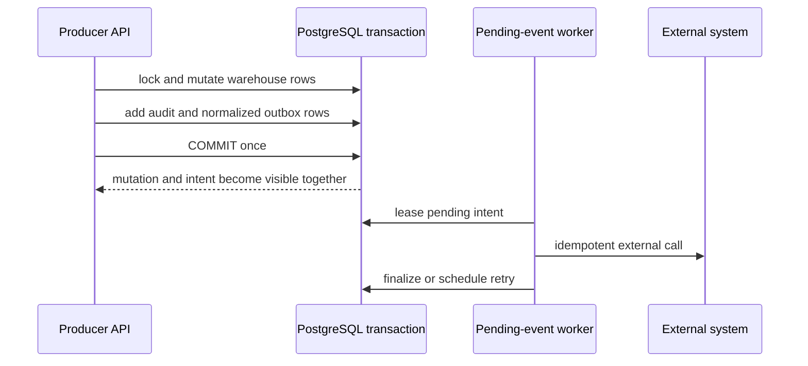

# Atomic Outbox

Warehouse producers persist business state, audit evidence, and durable external intent in one database transaction. Producers do not call Google Sheets, SkladBot, Telegram, or another external client.

The delivery contract is at-least-once: a worker can repeat an external call after a timeout or crash. `idempotency_key` protects one logical intent, while `action`, `aggregate_type`, and `aggregate_id` provide indexed diagnostics without scanning JSON. Scan keys include the scan transition UUID so a later scan is not suppressed by an older completed event.

Fault boundaries:

| Injection point | Warehouse mutation | Outbox intent | Expected recovery |
|---|---:|---:|---|
| Before commit | absent | absent | retry producer request |
| Successful commit | visible | visible | worker processes intent |
| After commit, before response | visible | visible | caller may retry; idempotency returns existing intent |
| Worker before external acknowledgement | visible | pending/leased | lease expiry and idempotent retry |

Outbox helpers may add, query, flush, redact, and bound payloads. They must not commit, roll back, or instantiate external clients. Payload keys containing credential markers are redacted before storage and secret-like strings use the shared redactor. Large Google import projections are split into ordered intents inside the same transaction; every encoded event stays at or below 2 MiB, and a single oversized record is rejected before commit.

Revision `20260710_0011` is expand-only. Legacy payload keys remain dual-written and consumers keep their existing contract. Production migration, worker rollout, and live fault probes require the Phase 27 production approval gate.
