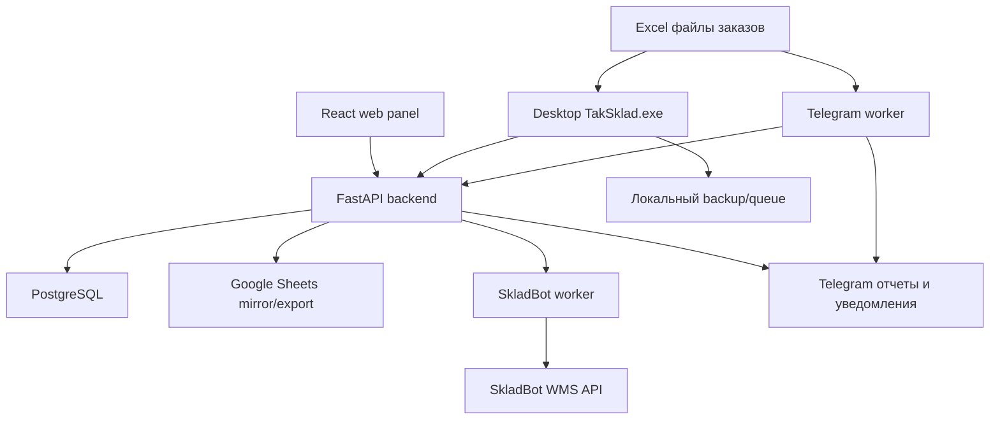

# TakSklad: суть приложения, логика, структура и стек

Актуально на: 15.06.2026
Текущая версия по коду и release manifest: `2.0.15`
Репозиторий: `1fear/TakSklad`
Назначение файла: один общий обзор проекта для передачи разработчику, интегратору, техподдержке или внутренней команде.

Документ собран по текущему коду, `README`, документации из `docs/`, manifests, Docker Compose, SQL-схеме и тестам. Секреты, токены, реальные chat_id, Google credentials, `.env`, `TakSklad_data.json` и рабочие логи не читались и не включены.

## 1. Короткий вывод

TakSklad - складская система вокруг процесса Chapman/КИЗов:

1. принимает Excel-заказы через Telegram или desktop;
2. нормализует строки заказа;
3. создает заказы и позиции в backend/PostgreSQL;
4. зеркалит данные в Google Sheets;
5. создает/сопоставляет заявки SkladBot;
6. дает складу сканировать КИЗы в Windows desktop-приложении;
7. защищает от дублей, wrong-SKU, недосканов и повторного использования КИЗов без возврата;
8. обрабатывает возвраты так, чтобы КИЗы снова становились доступными для новой отгрузки;
9. формирует КИЗ-выгрузки, логистические отчеты и ежедневные SkladBot-отчеты;
10. дает web-панель для контроля заказов, статусов, Google/SkladBot-синхронизации и ручных действий.

Главная архитектурная линия сейчас:

- **PostgreSQL на VDS - основной источник данных.**
- **Desktop - рабочий интерфейс склада для сканирования и печати.**
- **Telegram worker - серверный канал импорта, отчетов и ручного управления.**
- **SkladBot - внешняя WMS и источник остатков/заявок.**
- **Google Sheets - зеркало/витрина и legacy fallback, но не основная база.**

## 2. Название и продуктовая суть

Название: `TakSklad`.

Тип продукта:

- складское desktop-приложение;
- backend API;
- Telegram-бот;
- web admin panel;
- набор фоновых workers;
- интеграционный слой между Excel, SkladBot, Google Sheets и складским сканированием.

Кому нужно:

- складу: быстро и без ошибок сканировать КИЗы;
- менеджеру: загружать Excel, выбирать дату отгрузки, получать логистику и КИЗы;
- руководителю: видеть активные заказы, остатки, движение, ошибки, отчеты;
- техподдержке: иметь логи, backup, restore, диагностику и безопасный rollout.

Основная боль, которую закрывает приложение:

- ручная работа с КИЗами в таблицах;
- дубли КИЗов;
- ошибки SKU при сканировании;
- заказы без SkladBot-номеров;
- расхождения между Google, БД, SkladBot и фактом склада;
- отсутствие понятных отчетов по отгрузкам, возвратам, приемкам и остаткам;
- зависимость от одного компьютера или одного Google Sheets.

## 3. Основной бизнес-процесс

### 3.1 Импорт заказов

Оператор или менеджер отправляет Excel-файл в Telegram-бот или загружает файл через desktop.

Telegram-сценарий:

1. пользователь отправляет `.xlsx` или `.xlsm`;
2. бот не импортирует файл сразу;
3. бот просит дату отгрузки в формате `ДД.ММ.ГГГГ`;
4. введенная дата становится source of truth для этих заказов;
5. файл ставится в очередь `pending_events`;
6. backend normalizer разбирает Excel;
7. backend создает `orders` и `order_items`;
8. Google Sheets получает mirror/export;
9. SkladBot worker создает или сопоставляет заявки.

Почему дата вводится вручную: раньше файл мог содержать дату `09.06`, а бот создавал заказы на `08.06`. Чтобы такого не было, дата из файла/названия больше не является финальным источником.

### 3.2 Нормализация Excel

Поддерживаются разные шаблоны Excel. Нормализатор ищет колонки по алиасам:

- клиент: `ФИО или Наименование торговой точки`, `Клиент`, `Юр. лицо`, `Юр лицо`, `Наименование`;
- оплата: `Тип оплаты`, `Оплата`;
- товар: `Наименование Товара`, `Товары`, `Товар`, `Номенклатура`;
- количество: `Кол-во`, `Количество`, `Кол-во ШТ`, `Количество ШТ`;
- дата: `Дата доставки`, `Дата отгрузки`, `Дата получения заказа`, `Дата заказа`, `Дата`;
- адрес/координаты/ТП/ИНН - дополнительные поля.

Количество приводится к блокам. Для Chapman один блок = 10 штук. Цена блока по текущему процессу = `240 000 сум`, если в файле нет готовой суммы.

Если адрес пустой или технический, backend записывает `Самовывоз со склада`. Такие заказы не попадают в логистический отчет, если нет валидных координат.

### 3.3 Группировка заказов

Заказы группируются по рабочим признакам:

- дата отгрузки;
- клиент;
- тип оплаты;
- адрес;
- SkladBot-заявка, если уже найдена/создана.

Это защищает от смешивания:

- одного клиента с разной оплатой;
- одного клиента на разные адреса;
- разных SkladBot-заявок одного клиента;
- разных дат отгрузки.

### 3.4 SkladBot

SkladBot - внешняя WMS. TakSklad использует его для:

- создания/сопоставления заявок на отгрузку;
- заявок возврата/приемки;
- получения номеров `WH-R-...`;
- проверки текущих остатков;
- ежедневного отчета по заявкам, приемкам, возвратам, отгрузкам и остаткам.

Ключевое правило матчинга:

- дата отгрузки/выгрузки должна совпадать;
- клиент сравнивается строго после нормализации;
- тип оплаты учитывается;
- товар сравнивается по нормализованному Chapman SKU;
- количество сравнивается в блоках;
- адрес не является жестким критерием, он используется как диагностика;
- если найдено несколько кандидатов, случайный выбор запрещен.

SkladBot API имеет rate limit. В коде есть задержки между запросами и обработка `429 Too Many Requests` с учетом `Retry-After`/cooldown.

### 3.5 Сканирование КИЗов

Склад работает в Windows desktop-приложении.

Процесс:

1. оператор выбирает заказ;
2. видит текущую позицию, клиента, адрес, оплату, план блоков, SkladBot-номер;
3. сканирует КИЗ;
4. приложение проверяет формат, дубль, SKU, доступность КИЗа;
5. правильный обычный КИЗ засчитывается как `+1 блок`;
6. правильный агрегационный код короба засчитывается как `+50 блоков`;
7. wrong-SKU отклоняется до записи;
8. duplicate КИЗ отклоняется с понятным описанием;
9. результат уходит в backend;
10. backend пишет `scan_codes`, `kiz_codes`, `kiz_movements`, `audit_log`;
11. Google Sheets обновляется через mirror/export.

Последнее улучшение `2.0.15`: если КИЗ уже отсканирован в другом заказе, desktop показывает красное toast-уведомление снизу с полным текстом:

- в каком заказе занят КИЗ;
- юрлицо;
- дата отгрузки;
- товар;
- номер SkladBot;
- код КИЗа.

### 3.6 Возвраты

Логика возвратов нужна, чтобы один и тот же КИЗ мог повторно уехать после фактического возврата.

Целевой процесс:

1. склад/оператор сканирует или вводит номер накладной исходной отгрузки;
2. система находит заказ;
3. переводит заказ в возвраты;
4. пишет movement `return` по КИЗам;
5. КИЗы снова доступны для новой отгрузки;
6. повторный возврат той же накладной запрещается;
7. создается/фиксируется заявка возврата/приемки SkladBot;
8. в отчетах видно, кто вернул, что вернул, когда и по какой накладной.

Технически это держится на таблицах `kiz_codes` и `kiz_movements`: не только факт скана, а история движения КИЗа.

### 3.7 Отчеты

Есть несколько типов отчетов:

- логистический отчет по дате отгрузки;
- КИЗ-выгрузка по завершенным импортам/файлам;
- КИЗ-выгрузка по дате;
- daily report по SkladBot;
- day report из backend/Postgres;
- diagnostics log;
- отчеты по импортам и недосканам.

Важное разделение:

- логистический отчет строится из backend/Postgres и не должен зависеть от факта сканирования;
- КИЗ-выгрузка доступна только по полностью отпиканным позициям/файлам;
- ежедневный SkladBot-отчет строится из SkladBot API, а не из Google Sheets;
- Google Sheets не должен блокировать складскую работу.

## 4. Архитектура системы



Текущий тип проекта: монорепозиторий.

Основные части:

- `src/taksklad/` - desktop-приложение на Python/Tkinter;
- `backend/app/` - FastAPI backend и workers;
- `frontend/` - React/Vite web panel;
- `deploy/vds/` - Docker Compose для VDS;
- `deploy/traefik/` - Traefik stack;
- `backend/sql/` - SQL-схема;
- `tests/` - unittest regression suite;
- `.github/workflows/` - Windows release workflow;
- `docs/` - документация, changelog, runbooks.

## 5. Source of truth

| Данные | Основной источник | Зеркало / fallback | Комментарий |
|---|---|---|---|
| Заказы и позиции | PostgreSQL | Google Sheets | Google больше не должен быть WMS-базой |
| Сканированные КИЗы | PostgreSQL | Google Sheets, local backup | `scan_codes` + `kiz_movements` |
| Движение КИЗов | PostgreSQL | отчеты | Нужно для возвратов и повторной отгрузки |
| Импорты Excel | PostgreSQL | Google Sheets | `imports`, `import_files`, `raw_payload` |
| SkladBot номера | SkladBot + PostgreSQL | Google Sheets | SkladBot worker подтягивает/создает |
| Остатки SkladBot | SkladBot API | daily report XLSX | Для ежедневного SkladBot отчета |
| Telegram state/queue | PostgreSQL `pending_events` | worker memory только на цикл | Не зависит от открытого desktop |
| Локальная защита склада | local JSON/backup | backend retry | Нужна, чтобы склад не терял сканы |

## 6. Стек технологий

### 6.1 Desktop

| Слой | Технология |
|---|---|
| Язык | Python 3.12 |
| GUI | Tkinter |
| Excel | `openpyxl`, `pandas` |
| Google Sheets | `gspread`, `oauth2client` |
| Изображения/печать | `Pillow`, системная печать Windows/Unix |
| HTTP | стандартный `urllib`, общий HTTPS client, `certifi` |
| Сборка Windows | PyInstaller |
| Автообновление | GitHub Releases + `version.json` + SHA256 |
| Локальное состояние | JSON-файлы рядом с приложением |

Файл зависимостей: `requirements.txt`.

### 6.2 Backend

| Слой | Технология |
|---|---|
| Язык | Python 3.12 |
| Web framework | FastAPI `0.115.6` |
| ASGI server | Uvicorn `0.34.0` |
| DTO/schema | Pydantic `2.10.4` |
| ORM | SQLAlchemy `2.0.36` |
| DB driver | `psycopg[binary] 3.2.3` |
| HTTP client | `httpx 0.28.1` |
| Excel generation | `openpyxl 3.1.5` |
| Google Sheets | `gspread 6.2.1` |

Файл зависимостей: `backend/requirements.txt`.

### 6.3 Frontend

| Слой | Технология |
|---|---|
| Framework | React `19.2.1` |
| Build tool | Vite `7.2.4` |
| Язык | TypeScript `5.9.3` |
| Icons | `lucide-react` |
| Runtime deploy | Nginx container |

Файл зависимостей: `frontend/package.json`.

### 6.4 Infrastructure

| Слой | Технология |
|---|---|
| VDS OS | Ubuntu на VPS |
| Containers | Docker + Docker Compose |
| Reverse proxy | Traefik |
| TLS | Let's Encrypt через Traefik |
| Database | PostgreSQL 16 Alpine |
| Admin DB UI | Adminer |
| Web frontend serving | Nginx |
| Backups | shell scripts + systemd timer |
| Release | GitHub Actions + GitHub Releases |

Основной compose: `deploy/vds/docker-compose.yml`.

## 7. Backend API

Точка входа: `backend/app/main.py`.

Публичный health endpoint:

- `GET /health`

Auth endpoints web panel:

- `POST /api/v1/auth/login`
- `POST /api/v1/auth/logout`
- `GET /api/v1/auth/session`
- `GET /api/v1/auth/check`

Основные API endpoints:

- `GET /api/v1/orders/active` - активные заказы для desktop;
- `POST /api/v1/imports` - импорт строк Excel в Postgres;
- `GET /api/v1/imports` - история импортов;
- `POST /api/v1/scans` - запись скана КИЗа;
- `POST /api/v1/scans/undo` - отмена скана;
- `POST /api/v1/orders/{order_id}/complete` - завершение заказа;
- `GET /api/v1/returns` - список возвратов;
- `GET /api/v1/returns/lookup` - поиск заказа для возврата;
- `POST /api/v1/returns/{order_id}` - отметить возврат;
- `GET /api/v1/reports/day` - дневная сводка по Postgres;
- `GET /api/v1/reports/kiz/source-files` - доступные файлы для КИЗ-выгрузки;
- `GET /api/v1/reports/kiz/dates` - даты для КИЗ-выгрузки;
- `GET /api/v1/reports/kiz/date` - КИЗы за дату;
- `GET /api/v1/reports/kiz/range` - КИЗы за период;
- `GET /api/v1/reports/kiz/source-file` - КИЗы по исходному файлу;
- `GET /api/v1/logistics/dates` - даты логистики;
- `GET /api/v1/logistics/report` - XLSX логистики;
- `GET /api/v1/diagnostics/logs` - диагностический лог.

Admin/web endpoints:

- `GET /api/v1/admin/table` - таблица web-панели;
- `POST /api/v1/admin/google/pending/retry` - повторить pending Google exports;
- `POST /api/v1/admin/orders/bulk/complete-without-kiz` - массово закрыть без КИЗов;
- `POST /api/v1/admin/orders/{order_id}/archive-without-kiz`;
- `POST /api/v1/admin/orders/{order_id}/cancel`;
- `POST /api/v1/admin/orders/{order_id}/delete-active`;
- `POST /api/v1/admin/orders/{order_id}/resync-google`;
- `POST /api/v1/admin/orders/{order_id}/reset-rescan`;
- `POST /api/v1/admin/orders/{order_id}/restore`;
- `POST /api/v1/admin/orders/{order_id}/resync-skladbot`;
- `GET /api/v1/admin/skladbot/dry-runs`;
- `POST /api/v1/admin/skladbot/dry-runs/{dry_run_id}/rebuild`;
- `POST /api/v1/sync/sources`.

Авторизация:

- `/health` открыт;
- `/api/v1/*` защищены Bearer token или web session cookie;
- web login имеет lockout по неудачным попыткам.

## 8. База данных

SQL-схема:

- `backend/sql/001_initial_schema.sql`;
- дополнительно есть `backend/sql/002_kiz_movements.sql` для движений КИЗов/backfill.

ORM-модели: `backend/app/models.py`.

Основные таблицы:

| Таблица | Назначение |
|---|---|
| `orders` | заказ/группа клиента |
| `order_items` | товарные позиции заказа |
| `scan_codes` | принятые сканы КИЗов |
| `kiz_codes` | уникальные КИЗы |
| `kiz_movements` | история движения КИЗа: outbound/return/etc |
| `imports` | история импортов |
| `import_files` | файлы импорта и SHA256 |
| `pending_events` | очередь событий workers |
| `audit_log` | аудит действий |
| `users` | web/admin users |

Миграции: добавлен Alembic baseline `backend/migrations/versions/20260616_0001_initial_schema_baseline.py`. Старый SQL apply flow сохранен для bootstrap/legacy VDS, но новые production-изменения схемы должны идти через Alembic runbook с backup/restore plan.

## 9. Desktop-приложение

Точки входа:

- `main.py` - dev/local entrypoint;
- `pyinstaller_entry.py` - entrypoint для PyInstaller;
- `src/taksklad/main.py` - основной Tkinter app.

Ключевые desktop-модули:

| Файл | Роль |
|---|---|
| `src/taksklad/main.py` | UI, выбор заказов, сканирование, статусы, toast ошибки |
| `src/taksklad/config.py` | версии, пути, колонки, интеграционные настройки |
| `src/taksklad/backend_client.py` | HTTP client к backend |
| `src/taksklad/backend_events.py` | локальная очередь backend-событий |
| `src/taksklad/excel_import.py` | legacy/desktop Excel import |
| `src/taksklad/excel_normalizer.py` | распознавание Excel-шаблонов |
| `src/taksklad/orders.py` | группировка, статусы, ключи дублей |
| `src/taksklad/scan_quantities.py` | обычный КИЗ `+1`, короб `+50` |
| `src/taksklad/sheets.py` | Google Sheets legacy/fallback |
| `src/taksklad/skladbot.py` | desktop SkladBot client/fallback |
| `src/taksklad/skladbot_sync.py` | desktop SkladBot matching |
| `src/taksklad/pending_store.py` | local queues и scan backups |
| `src/taksklad/printing.py` | печать сводных листов |
| `src/taksklad/reports.py` | legacy desktop reports |
| `src/taksklad/telegram_service.py` | legacy Telegram service |
| `src/taksklad/update_service.py` | auto-update download/verify |
| `src/taksklad/app_updates.py` | UI автообновления |
| `src/taksklad/ui_widgets.py` | общие Tkinter виджеты, включая error toast |
| `src/taksklad/desktop_diagnostics.py` | диагностика desktop |

Локальные рабочие файлы рядом с приложением:

- `credentials.json`;
- `TakSklad_data.json`;
- `telegram_settings.json`;
- `pending_saves.json`;
- `pending_prints.json`;
- `pending_telegram.json`;
- `pending_backend_events.json`;
- `product_catalog.json`;
- `import_history.json`;
- `scan_backups/`;
- `reports/`;
- `docs/TakSklad.log`.

Эти файлы могут содержать рабочие данные и не должны попадать в Git.

## 10. Backend workers

В `deploy/vds/docker-compose.yml` выделены отдельные сервисы:

| Service | Command | Назначение |
|---|---|---|
| `backend-api` | `uvicorn app.main:app` | API для desktop, frontend, workers |
| `skladbot-worker` | `python -m app.skladbot_worker` | SkladBot sync/create/reconcile |
| `google-sheets-sync-worker` | `python -m app.google_sheets_sync_worker` | mirror/sync с Google Sheets |
| `telegram-worker` | `python -m app.telegram_worker` | Telegram bot, imports, reports, manual actions |
| `frontend` | Nginx | React web panel |
| `postgres` | PostgreSQL 16 | основная БД |
| `adminer` | Adminer | DB admin UI |

Workers используют `pending_events` как простую очередь MVP. Это осознанный выбор: Postgres + polling проще и надежнее для текущего масштаба, чем отдельный брокер.

## 11. Telegram bot

Основной production bot сейчас работает на VDS через `backend/app/telegram_worker.py`.

Функции:

- прием Excel-файлов;
- ручной ввод даты отгрузки;
- очередь импортов;
- логистический отчет по дате;
- КИЗ-выгрузки;
- статус backend;
- последние импорты;
- ручное управление заказами;
- ручное добавление заказа;
- ручное удаление активного заказа, если заказ еще не начали обрабатывать;
- daily SkladBot report по расписанию;
- скрытые/admin команды для диагностики.

Важное UI-решение Telegram:

- отказ от навязчивых inline-кнопок;
- использование reply keyboard / меню так, чтобы кнопки можно было убрать;
- старые файлы для КИЗ-выгрузки ограничиваются последними днями, чтобы не создавать визуальный шум.

## 12. Web frontend

Путь: `frontend/`.

Основные файлы:

- `frontend/src/App.tsx`;
- `frontend/src/api.ts`;
- `frontend/src/styles.css`.

Назначение web-панели:

- таблица заказов;
- фильтры по статусу, дате, scan state, SkladBot, Google;
- массовые действия;
- reset/rescan;
- архив без КИЗов;
- архив как выполнено;
- отмена;
- восстановление;
- resync Google;
- resync SkladBot;
- dry-run SkladBot заявок;
- история импортов;
- дневной отчет;
- активность/audit.

Web panel работает same-origin через frontend container и backend `/api`.

## 13. Google Sheets

Исторически Google Sheets был рабочей базой. Сейчас его роль меняется.

Листы:

- `data` - зеркало активных/рабочих строк;
- `Архив` - архивные строки;
- `Возвраты` - возвраты;
- `_TakSklad_System` - legacy Telegram lock/state.

Текущая целевая роль:

- mirror/export для людей;
- fallback для старой desktop-линии;
- не блокировать склад, если Google API упал;
- не быть primary DB.

Google API rate limit был реальной проблемой, поэтому backend содержит:

- pending exports;
- retry;
- cooldown;
- rate-limit detection;
- отдельный `google-sheets-sync-worker`.

## 14. SkladBot integration

Основные backend-файлы:

- `backend/app/skladbot_worker.py`;
- `backend/app/skladbot_request_dry_run.py`;
- `backend/app/skladbot_return_requests.py`;
- `backend/app/skladbot_daily_report.py`;
- `backend/app/skladbot_diagnostic.py`;
- `backend/app/skladbot_coverage_diagnostic.py`.

Что используется:

- заявки;
- детали заявок;
- продукты/остатки;
- складские движения;
- отчеты по остаткам/transactions;
- request create для нужных сценариев;
- delay и retry на rate limit.

Старый аудит SkladBot API фиксировал, что публичный API выглядел read/reporting-first и create/update не были подтверждены. В текущем коде уже есть интеграция создания нужных заявок, но это нужно считать конкретной реализованной интеграцией под доступный API, а не общим правом менять любые WMS-данные.

## 15. Автообновление Windows

Файлы:

- `version.json`;
- `src/taksklad/update_service.py`;
- `src/taksklad/app_updates.py`;
- `.github/workflows/build-windows-release.yml`;
- `tools/release_preflight.py`;
- `tools/build_windows_test_archive.ps1`.

Текущий manifest:

- `latest_version`: `2.0.15`;
- `min_supported_version`: `2.0.15`;
- `mandatory`: `true`;
- package: onefile `TakSklad.exe`;
- release assets: `TakSklad.exe`, `TakSklad-windows-x64.zip`, SHA256 files.

Логика:

1. desktop проверяет public `version.json`;
2. сравнивает версию;
3. скачивает release asset;
4. проверяет SHA256;
5. запускает updater/install;
6. защищается от бесконечного цикла retry через cooldown.

## 16. Release и deploy

VDS deploy:

- backend и workers доставляются на VDS;
- Docker Compose пересобирает сервисы;
- Traefik публикует backend/frontend по доменам;
- Postgres живет во внутренней сети;
- API защищен токеном/session.

Основные deploy files:

- `deploy/vds/docker-compose.yml`;
- `deploy/vds/.env.example`;
- `deploy/vds/apply_schema.sh`;
- `deploy/vds/backup_postgres.sh`;
- `deploy/vds/restore_postgres.sh`;
- `deploy/vds/restore_drill.sh`;
- `deploy/vds/acceptance_status.sh`;
- `deploy/traefik/docker-compose.yml`.

Windows release:

- GitHub Release tag `v2.0.15`;
- GitHub Actions собирает onefile и onedir;
- smoke test release assets;
- upload assets и SHA.

## 17. Тесты и проверки

Runner: Python `unittest`.

Основная команда:

```bash
./.venv/bin/python -m unittest discover -s tests
```

Дополнительные проверки:

```bash
git diff --check
./.venv/bin/python -m compileall -q backend/app src/taksklad tests tools
npm --prefix frontend run build
docker compose --env-file deploy/vds/.env.example -f deploy/vds/docker-compose.yml config
./.venv/bin/python tools/release_preflight.py
```

Что покрывают тесты:

- backend API persistence;
- scan conflicts;
- SKU validation;
- returns lifecycle;
- Google Sheets export/pending/sync;
- Telegram import;
- SkladBot worker/daily report/dry-run;
- Excel normalizer;
- desktop UI contract;
- backend bridge;
- release/preflight;
- VDS scripts;
- Windows release workflow.

По последнему production-релизу `2.0.15` полный suite проходил: `428 tests OK`.

## 18. Структура проекта

```text
TakSklad/
  README.md
  requirements.txt
  version.json
  main.py
  pyinstaller_entry.py
  assets/
  backend/
    Dockerfile
    requirements.txt
    app/
      main.py
      models.py
      schemas.py
      orders_service.py
      imports_service.py
      order_actions_service.py
      google_sheets_exporter.py
      google_sheets_pending.py
      google_sheets_sync_worker.py
      skladbot_worker.py
      skladbot_daily_report.py
      skladbot_return_requests.py
      telegram_worker.py
      ...
    sql/
      001_initial_schema.sql
      002_kiz_movements.sql
  src/
    taksklad/
      main.py
      config.py
      backend_client.py
      backend_events.py
      excel_import.py
      excel_normalizer.py
      orders.py
      scan_quantities.py
      sheets.py
      skladbot.py
      skladbot_sync.py
      pending_store.py
      printing.py
      reports.py
      telegram_service.py
      update_service.py
      ui_widgets.py
      ...
  frontend/
    package.json
    Dockerfile
    src/
      App.tsx
      api.ts
      styles.css
  deploy/
    vds/
      docker-compose.yml
      *.sh
    traefik/
      docker-compose.yml
  tests/
    test_*.py
  tools/
    release_preflight.py
    build_windows_test_archive.ps1
    windows_backend_acceptance.ps1
    ...
  docs/
    project-architecture.md
    project-knowledge-base.md
    user-business-process-guide.md
    implementation-log.md
    changelog.md
    ...
```

## 19. Важные правила разработки

1. Не ломать складской desktop flow.
2. Не считать Google Sheets primary DB.
3. Любое изменение остатка/КИЗа должно иметь movement/audit.
4. Wrong-SKU и duplicate KIZ должны отклоняться до записи.
5. Возврат должен освобождать КИЗ только через явное движение возврата.
6. SkladBot rate limits нужно уважать задержками и retry.
7. Telegram import всегда требует ручную дату отгрузки.
8. Заказы, которые начали сканировать, нельзя просто удалить без учета факта обработки.
9. Секреты не писать в docs, git, логи, Telegram и export.
10. Перед release: tests, frontend build, preflight, SHA, VDS health, logs.

## 20. Известные ограничения и места внимания

1. Часть старых docs датирована 30-31.05 и описывает staging `2.0.0`; текущий код уже `2.0.15`.
2. `vds-release-readiness.md` полезен как исторический runbook, но часть статусов устарела.
3. Alembic baseline есть, но первый production rollout требует дисциплины: backup, проверка текущей схемы и baseline stamp перед `upgrade head`, если БД уже создана старым SQL.
4. Google Sheets API может ловить quota/rate limit, поэтому нельзя возвращать Google как единственный источник.
5. SkladBot API имеет rate limit и разные форматы дат в разных endpoints.
6. Windows acceptance важнее web smoke: scanner, Tkinter, печать и auto-update проверяются только на складских ПК.
7. Старые возвраты до внедрения movement lifecycle могут требовать ручной чистки.
8. Raw logs, backups и restore snapshots могут содержать рабочие данные, их нельзя копировать в общие документы без чистки.

## 21. Команды для разработки

Установка зависимостей:

```bash
cd /Users/anton/Documents/work/TakSklad
./.venv/bin/python -m pip install -r requirements.txt -r backend/requirements.txt
```

Desktop:

```bash
./.venv/bin/python main.py
```

Backend local:

```bash
cd /Users/anton/Documents/work/TakSklad/backend
../.venv/bin/uvicorn app.main:app --reload --host 0.0.0.0 --port 8000
```

Frontend:

```bash
cd /Users/anton/Documents/work/TakSklad/frontend
npm ci
npm run dev
npm run build
```

VDS/Compose local config:

```bash
cd /Users/anton/Documents/work/TakSklad
docker compose --env-file deploy/vds/.env.example -f deploy/vds/docker-compose.yml config
```

Full tests:

```bash
./.venv/bin/python -m unittest discover -s tests
```

Release preflight:

```bash
./.venv/bin/python tools/release_preflight.py
```

## 22. Прочитанные источники

Документация:

- `README.md`;
- `backend/README.md`;
- `docs/project-overview.md`;
- `docs/project-architecture.md`;
- `docs/project-knowledge-base.md`;
- `docs/user-business-process-guide.md`;
- `docs/taksklad-full-functionality.md`;
- `docs/implementation-log.md`;
- `docs/changelog.md`;
- `docs/vds-release-readiness.md`;
- `docs/deploy-rollback-runbook.md`;
- `docs/local-development-setup.md`;
- `docs/roadmap.md`;
- `docs/skladbot-api-key-functionality.md`;
- `docs/windows-backend-acceptance.md`;
- `docs/manual-acceptance-runbook.md`.

Код и manifests:

- `requirements.txt`;
- `backend/requirements.txt`;
- `frontend/package.json`;
- `version.json`;
- `backend/app/main.py`;
- `backend/app/models.py`;
- `backend/sql/001_initial_schema.sql`;
- `deploy/vds/docker-compose.yml`;
- `src/taksklad/config.py`;
- `src/taksklad/main.py`;
- `src/taksklad/backend_client.py`;
- `src/taksklad/backend_events.py`;
- `frontend/src/App.tsx`;
- `frontend/src/api.ts`;
- `.github/workflows/build-windows-release.yml`;
- `tests/`.

Не использовались как источник содержания:

- `docs/TakSklad.log`;
- `.env`;
- `credentials.json`;
- `TakSklad_data.json`;
- реальные Telegram/SkladBot/Google токены;
- рабочие backups и restore snapshots.
