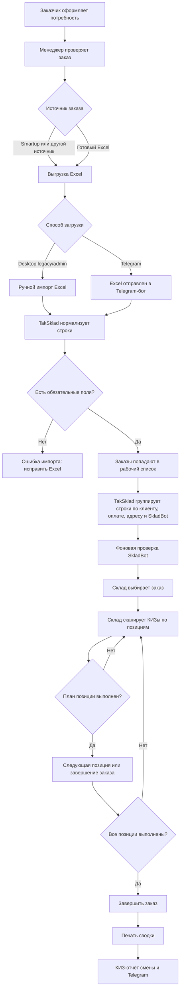
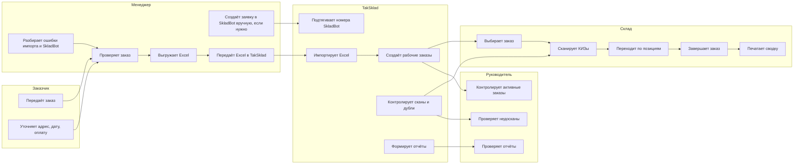
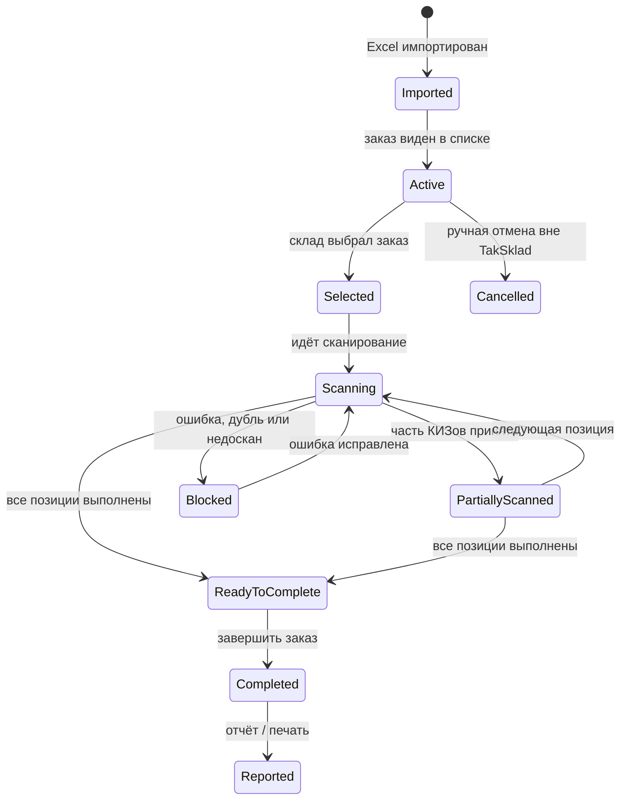

# TakSklad: Пользовательская Инструкция И Бизнес-Процесс

Дата: 2026-05-30.

Документ описывает TakSklad не со стороны кода, а со стороны бизнеса: кто что делает, когда появляются заказы, как они попадают в систему, как склад сканирует КИЗы, где участвует SkladBot, где участвует Telegram, что видит руководитель и что делать при ошибках.

## 1. Короткий Вывод

TakSklad сейчас закрывает процесс:

1. Получить заказы в Excel.
2. Загрузить Excel через desktop-приложение или Telegram-бот.
3. Создать рабочий список заказов.
4. Подтянуть номера заявок SkladBot, если они есть.
5. Передать заказ складу.
6. Отсканировать КИЗы по позициям.
7. Защититься от дублей и недосканов.
8. Завершить заказ.
9. Напечатать сводный лист после готового юрлица.
10. В конце смены сформировать КИЗ-отчёт смены.
11. Получить отчёты, логи и документы в Telegram по кнопкам нижнего меню.

Печать сводного листа не открывает браузер. После `ЗАВЕРШИТЬ ЗАКАЗ` появляется окно печати: выбор принтера, размер этикетки `100x100`, `100x150`, `75x50` или `58x40`, подтверждение кнопкой `ПЕЧАТАТЬ` или клавишей `Enter`.

КИЗ-отчёт смены не считается обычным “дневным отчётом”. Он делится по датам отгрузки: если склад сегодня сканировал заказы на 2 и 3 мая, в Telegram уходят отдельные файлы. Если по одной дате работу добивают частями, файлы получают `ч1`, `ч2` и далее.

Обычно в течение дня менеджер отправляет несколько Excel-файлов. После импорта менеджер может выгрузить `Отчёт логистики` по нужной дате отгрузки. Этот отчёт не зависит от склада и от КИЗов.

Проблема старой версии 1.1.7 с разными шаблонами закрывается через backend import: каждая строка проходит нормализацию, результат импорта фиксирует количество строк, предупреждения и ошибки.

Важно:

- прямой автоматический импорт из Smartup добавляется как серверный worker и по умолчанию выключен env-флагами;
- Smartup остаётся источником заказов по фильтру `Новые + Терминал`, а дата отгрузки берётся из `delivery_date` и при необходимости переносится по календарю логистики на ближайший рабочий день;
- TakSklad создаёт SkladBot-заявки только когда включён существующий режим `SKLADBOT_CREATE_REQUESTS_MODE=enabled`;
- SkladBot также используется для чтения и сопоставления номеров заявок;
- web frontend сейчас черновой staging-интерфейс, а не основной рабочий инструмент склада;
- основной рабочий инструмент склада сейчас - desktop-приложение TakSklad на Windows.

### 1.1 Зафиксированные Правила Нового Процесса

Эти правила считаются утверждёнными для следующей доработки.

1. При загрузке Excel через Telegram бот всегда спрашивает дату отгрузки отдельным сообщением. Оператор вводит дату в формате `ДД.ММ.ГГГГ`, и именно эта дата используется для создания заказов и SkladBot-заявок. До ввода даты заказы не создаются.
2. Все количества приводятся к единому формату. Excel может содержать количество в пачках/штуках, а SkladBot работает в блоках. Для SkladBot-сравнения используется только `Кол-во блок`; сравнивать пачки напрямую с SkladBot нельзя. `Кол-во ШТ` хранится отдельно для отчётов и проверки.
3. Товары сравниваются не по полной строке, а по нормализованному SKU: цвет и формат. Для Chapman используются ключи `brown`, `red`, `gold` и типы `OP`/`SSL`. Длинные названия SkladBot вроде `Chapman Brown OP 20 UZ - KingSize` должны совпадать с импортом `Chapman Brown OP 20`, если совпали цвет, формат и количество блоков.
4. Адрес не является жёстким критерием SkladBot-матчинга. Он используется как дополнительная проверка. Основные поля: дата отгрузки/выгрузки, юрлицо, тип оплаты, товары и блоки.
5. Для маршрутного листа логистики нужны именно координаты, а не адрес. Если координат нет или они невалидны, заказ не попадает в маршрутный лист `Заявки`, но остается в логистическом Excel на листе `Требуют координаты`, чтобы менеджер видел, что нужно исправить.
6. Цена за блок фиксируется как `240 000 сум`. Если импортный файл не содержит готовую сумму по юрлицу или позиции, TakSklad считает сумму сам: `Кол-во блок * 240 000`. В сводочном листе для водителя/экспедитора должна быть общая сумма к получению по заказу.
7. Отчёт логистики не зависит от склада, сканирования КИЗов и архива. Менеджер может выгрузить его сразу после импорта заказов и выбора даты отгрузки.
8. Кнопка `Выгрузка КИЗов` показывает только те исходные Excel-файлы, по которым все позиции уже полностью отсканированы. Незавершённые файлы не предлагаются к выгрузке. Если в разные дни или разными сообщениями пришли файлы с одинаковым названием, TakSklad разделяет их по конкретному импорту и не смешивает КИЗы.

## 2. Роли Пользователей

### 2.1 Заказчик

Заказчик - клиент или внутренний источник заказа.

Что делает:

- передаёт потребность в товаре;
- согласует состав заказа, адрес, дату, оплату;
- может не работать напрямую в TakSklad.

Что не делает:

- не сканирует КИЗы;
- не исправляет Excel;
- не работает с SkladBot;
- не завершает складской заказ.

### 2.2 Менеджер

Менеджер отвечает за то, чтобы заказ стал понятным для склада.

Что делает:

- принимает заказ от клиента или из Smartup;
- проверяет дату отгрузки, клиента, адрес, оплату, товары и количество;
- выгружает или получает Excel;
- отправляет Excel в Telegram-бот или передаёт файл ответственному за ручной импорт;
- при необходимости создаёт заявку в SkladBot вручную;
- создаёт в SkladBot заявку `3PL отгрузка`, где указывает актуальную дату выгрузки, тип оплаты и корректного клиента;
- проверяет, что заказ появился в списке;
- проверяет статус сопоставления SkladBot;
- выгружает `Отчёт логистики` по нужной дате отгрузки;
- разбирает ошибки импорта.

Ключевая ответственность менеджера:

- в Excel должны быть заполнены клиент, оплата, товар и количество;
- дата, адрес и SkladBot-заявка должны быть понятны складу;
- если SkladBot не нашёлся, менеджер должен помочь понять причину.

### 2.3 Сотрудник Склада

Сотрудник склада работает в desktop-приложении TakSklad.

Что делает:

- запускает приложение;
- обновляет список заказов;
- выбирает заказ;
- сканирует КИЗы;
- переходит между позициями;
- завершает заказ;
- печатает сводный лист;
- сообщает менеджеру, если заказ не найден, не сходится или не закрывается.

Ключевая ответственность склада:

- не сканировать “куда попало”;
- сканировать только выбранную текущую позицию;
- не закрывать заказ до полного сканирования;
- не игнорировать ошибки дублей.

### 2.4 Руководитель / Старший Смены

Руководитель контролирует процесс целиком.

Что смотрит:

- сколько активных заказов осталось;
- какие заказы выполнены;
- какие позиции недосканированы;
- были ли ошибки импорта;
- были ли дубли КИЗов;
- сформирован ли КИЗ-отчёт смены;
- есть ли проблемы с Google, Telegram, SkladBot или backend.

Что решает:

- можно ли закрывать смену;
- нужно ли повторно импортировать Excel;
- нужно ли вручную исправить SkladBot-связку;
- нужно ли остановить rollout новой версии.

### 2.5 Администратор Системы

Администратор отвечает за техническую работоспособность.

Что делает:

- следит за доступами Google Sheets;
- хранит Telegram token, Google credentials, backend token и VDS-доступы вне Git;
- проверяет логи;
- запускает backup/restore;
- контролирует автообновления;
- включает backend flags только на тестовой Windows-копии до релиза.

## 3. Общая Схема Процесса



## 4. Процесс По Ролям



## 5. Вход Заказов

### 5.1 Вариант А: Заказы Приходят Из Smartup

Текущий статус: серверный контур Smartup -> TakSklad есть, но безопасно выключен по умолчанию до боевой проверки.

Рабочая автоматизация:

1. Worker запускается по слотам `12:00`, `15:00`, `17:50`.
2. Smartup выгружается по дате заказа сегодня и фильтрам `Новые + Терминал`.
3. Локально сохраняется файл `Терминал ДД.ММ.ГГГГ Часть N.xlsx` и audit JSON.
4. Перед записью в TakSklad выполняется backend preview.
5. После успешной выгрузки и preview Smartup-заказы переводятся в статус `В ожидании`.
6. Backend создаёт заказы по `delivery_date`, а не по дате заказа.
7. SkladBot create-events ставятся через существующий импортный контур.
8. На финальном слоте отправляется `Отчёт логистики` по датам отгрузки загруженных Smartup-заказов.
9. По умолчанию автоматические слоты не работают в субботу и воскресенье: `SMARTUP_AUTO_IMPORT_DISABLED_WEEKDAYS=5,6`.
10. Если `delivery_date` в Smartup попал на нерабочий день логистики, TakSklad переносит дату отгрузки вперед до ближайшего рабочего дня. Исходная дата Smartup остается в export/audit metadata.
11. Если финальный отчет попадает на нерабочую дату логистики, он не отправляется.

Календарь логистики:

- В web-admin есть вкладка `Календарь`.
- Суббота и воскресенье выделяются как нерабочие по умолчанию.
- Администратор может вручную отметить любой день как `Не работает`, например праздник или внутренний выходной логистики.
- Ручная отметка важнее дефолта: если день отмечен рабочим, automation считает его рабочим; если отмечен нерабочим, заказы переносятся дальше.
- Календарь показывает заказы, блоки и клиентов по датам отгрузки.

Ручной запуск конкретного слота:

```bash
docker compose exec smartup-auto-import-worker python -m app.smartup_auto_import_worker run-once --date 2026-06-25 --slot 15:00
```

История запусков доступна в web-admin во вкладке `Smartup`: там видны последние слоты, созданные файлы, ошибки, количество созданных заказов и статус SkladBot/logistics. Импорты, dry-run, инциденты и активность находятся в нижней группе `История действий`.

Для безопасного включения нужны env-флаги:

- `SMARTUP_AUTO_IMPORT_ENABLED=true`;
- `SMARTUP_AUTO_IMPORT_BACKEND_IMPORT_ENABLED=true`;
- `SMARTUP_AUTO_IMPORT_CHANGE_STATUS_ENABLED=true`;
- `SMARTUP_AUTO_IMPORT_DISABLED_WEEKDAYS=5,6` чтобы отключить субботу/воскресенье;
- `SKLADBOT_CREATE_REQUESTS_MODE=enabled` для реального создания заявок SkladBot;
- `SMARTUP_AUTO_IMPORT_LOGISTICS_CHAT_ID` для чата, куда отправлять итоговый отчёт логистики.
- `SMARTUP_AUTO_IMPORT_ALERT_CHAT_ID` для Telegram-ошибок automation; если пусто, используется logistics chat.

Обязательные поля в Excel:

- клиент;
- тип оплаты;
- товар;
- количество.

Желательные поля:

- дата отгрузки;
- адрес;
- торговый представитель;
- номер заявки SkladBot;
- ID заявки SkladBot.

Если Excel из Smartup отличается по названиям колонок, TakSklad пытается найти нужные поля по алиасам. Если обязательные поля не найдены, файл не импортируется.

### 5.2 Вариант Б: Excel Отправляют В Telegram-Бот

Рабочий процесс:

1. Менеджер или ответственный сотрудник отправляет или пересылает Excel в разрешённый Telegram-чат.
2. Telegram worker принимает файл и ставит его в очередь импорта.
3. Если отправить несколько Excel-файлов подряд, каждый файл становится отдельной задачей в очереди.
4. Worker берёт файлы из очереди по порядку.
5. Worker скачивает файл.
6. Worker проверяет формат `.xlsx` или `.xlsm`.
7. Worker разбирает лист `Заявки` или другой подходящий лист.
8. Worker отправляет строки в backend import.
9. Telegram возвращает сообщение с итогом:
   - сколько строк было в файле;
   - сколько строк отправлено в backend;
   - сколько позиций добавлено;
   - сколько заказов добавлено;
   - сколько дублей пропущено;
   - сколько ошибок найдено.

Важно:

- Telegram принимает файлы только от разрешённых пользователей/чатов;
- неизвестные chat_id игнорируются;
- файлы обрабатываются последовательно, а не одновременно;
- Telegram token и service token не должны быть в переписке, скриншотах или Git.

### 5.3 Вариант В: Excel Загружают Через Desktop

Рабочий процесс:

1. Открыть TakSklad.
2. Запустить ручной импорт Excel в legacy/admin-режиме.
3. Выбрать файл.
4. Проверить preview/результат импорта.
5. Подтвердить импорт.
6. Дождаться сообщения об успешном импорте.
7. Нажать `ОБНОВИТЬ`, если список не обновился автоматически.

Если файл содержит ошибки:

- исправить Excel;
- импортировать заново;
- не править рабочий лист вручную без понимания последствий.

## 6. Как Работает Импорт

TakSklad при импорте делает не просто копирование строк.

Он выполняет:

- поиск листа с заказами;
- поиск строки заголовков;
- поиск обязательных колонок по алиасам;
- пропуск пустых и итоговых строк;
- нормализацию даты;
- нормализацию количества;
- расчёт блоков;
- генерацию служебных ID;
- запись источника файла;
- защиту от повторного импорта той же позиции.

Если нет даты:

- дата берётся из файла;
- если в имени файла даты нет, дата ищется в строках над заголовком;
- если даты всё равно нет, используется текущая дата.

Если нет адреса:

- если есть координаты, desktop-линия может попытаться получить адрес через геокодер;
- если адрес получить нельзя, ставится техническая пометка `Координаты: ...`, а сами координаты сохраняются отдельно;
- если нет ни адреса, ни координат, заказ считается самовывозом и получает адрес `Самовывоз со склада`.

Если нет количества блоков:

- блоки считаются по справочнику товаров или fallback-правилу.

## 7. Где Хранятся Заказы

### 7.1 Backend-mode Линия

В backend-mode рабочее хранилище - PostgreSQL на VDS. Desktop получает активные заказы через backend API, отправляет сканы и завершение заказа в backend, а Google Sheets обновляется как mirror/export.

В Postgres хранятся:

- заказы;
- позиции;
- количество;
- план блоков;
- отсканированные КИЗы;
- статус;
- SkladBot-номер;
- служебные поля импорта;
- audit и pending events.

Активный список в desktop строится по backend active orders. Если backend недоступен, desktop использует уже загруженный кэш или показывает явную backend connectivity error. Автоматический возврат к Google в backend-only shadow режиме запрещён без явного emergency-флага.

### 7.2 Legacy Desktop/Google Линия

При выключенных backend flags старая desktop-линия может читать Google Sheets, лист `data`. Это legacy/fallback режим, а не целевой hot path.

Google `data` хранит зеркало:

- заказов;
- позиций;
- количества;
- плана блоков;
- отсканированных КИЗов;
- статусов;
- SkladBot-номеров;
- служебных полей импорта.

### 7.3 VDS-Линия 2.0

На VDS есть:

- backend API;
- Postgres;
- Telegram worker;
- SkladBot worker;
- web draft.

Широкий rollout backend-only на рабочие ПК разрешён только после Windows-приёмки. До этого backend-only включается через feature flags на одном тестовом профиле/ПК.

## 8. SkladBot В Процессе

### 8.1 Когда Менеджер Заводит Заявку В SkladBot

Заявка в SkladBot заводится до складской обработки, когда заказ уже понятен:

- клиент известен;
- дата отгрузки известна;
- адрес известен;
- товарный состав известен;
- количество известно.

Сейчас менеджер заводит заявку в SkladBot вручную.

TakSklad не создаёт заявку в SkladBot автоматически.

### 8.2 Что Делает TakSklad Со SkladBot

TakSklad читает заявки SkladBot и пытается найти соответствие.

Критерии:

- дата отгрузки в TakSklad равна дате выгрузки в SkladBot;
- клиент совпадает после нормализации;
- тип оплаты сопоставляется с комментарием;
- адрес достаточно похож;
- товары и блоки совпадают;
- найден только один кандидат.

Результаты:

- `Найдено` - номер заявки записан;
- `Не найдено` - подходящей заявки нет;
- `Несколько совпадений` - есть риск ошибочной привязки, нужен ручной разбор.

### 8.3 Что Делать Если SkladBot Не Нашёлся

Менеджер проверяет:

- есть ли заявка в SkladBot;
- совпадает ли дата выгрузки;
- совпадает ли клиент;
- совпадает ли адрес;
- совпадает ли товарный состав;
- не разбит ли один заказ на несколько Excel-импортов;
- нет ли нескольких похожих заявок.

Склад при этом может продолжать работу, если заказ виден и не выполнен. Номер SkladBot не должен блокировать сканирование КИЗов.

## 9. Desktop-Интерфейс Склада

Основной экран: `Учёт сканирования блоков`.

### 9.1 Левая Часть: Заказы

Элементы:

- `Заказы для КИЗов` - карточный список активных заказов;
- карточка заказа - юрлицо, номер заявки SkladBot, дата отгрузки, SKU и план блоков;
- поле поиска - поиск по клиенту/адресу/оплате/номеру/товару;
- `ОБНОВИТЬ` - перечитать список заказов;
- `ВЫБРАТЬ ЗАКАЗ` - открыть выбранный заказ для сканирования.

Как пользоваться:

1. Нажать `ОБНОВИТЬ`.
2. Найти нужный заказ в карточном списке.
3. Если заказов много, использовать поиск.
4. Выделить карточку заказа.
5. Нажать `ВЫБРАТЬ ЗАКАЗ`.

### 9.2 Правая Часть: Текущая Позиция

Элементы:

- `Текущая позиция` - какой товар сейчас сканируется;
- `Сканирование: X / Y` - сколько КИЗов принято из плана;
- поле `СКАНИРОВАНИЕ КОДА`;
- `ОТМЕНИТЬ ПОСЛЕДНИЙ КОД`;
- `СЛЕДУЮЩАЯ ПОЗИЦИЯ`;
- `ЗАВЕРШИТЬ ЗАКАЗ`;
- блок статистики;
- `ЗАВЕРШИТЬ ДЕНЬ (ОТЧЁТ)`.

Как пользоваться:

1. Убедиться, что выбрана правильная позиция.
2. Сканировать КИЗ.
3. Смотреть прогресс `X / Y`.
4. Если ошиблись последним кодом, нажать `ОТМЕНИТЬ ПОСЛЕДНИЙ КОД`.
5. После выполнения позиции перейти к следующей.
6. После выполнения всех позиций завершить заказ.

## 10. Правила Сканирования КИЗов

Сканирование выполняется после выбора заказа и текущей позиции.

Каждый КИЗ проверяется:

- код не пустой;
- код начинается с `01`;
- код не содержит русские буквы;
- код не короче минимально допустимого;
- код не слишком длинный;
- код не был уже принят в этой позиции;
- код не был уже принят в другом заказе;
- позиция ещё не выполнена.

Если код принят:

- он сразу попадает в локальный backup;
- затем отображается в прогрессе;
- позже записывается в Google Sheets/backend.

Если код не принят:

- оператор получает понятное сообщение;
- код не должен попадать в итоговый список;
- нужно повторить правильный скан или обратиться к старшему смены.

## 11. Переход По Позициям

Один заказ может содержать несколько товаров.

Пример:

- клиент A;
- адрес A;
- тип оплаты `наличные`;
- товар 1 - 2 блока;
- товар 2 - 3 блока.

Оператор:

1. Сканирует 2 КИЗа по товару 1.
2. Нажимает `СЛЕДУЮЩАЯ ПОЗИЦИЯ`.
3. Сканирует 3 КИЗа по товару 2.
4. Завершает заказ.

Если позиция не досканирована, переход или завершение могут быть заблокированы в зависимости от текущей логики контроля.

## 12. Завершение Заказа

Кнопка: `ЗАВЕРШИТЬ ЗАКАЗ`.

Перед завершением нужно проверить:

- все позиции выбраны и обработаны;
- по каждой обязательной позиции план выполнен;
- нет незакрытых ошибок;
- нет спорных дублей.

После завершения:

- заказ получает выполненный статус;
- сканы сохраняются в рабочее хранилище;
- заказ уходит из активного списка;
- формируется сводка;
- можно печатать документ.

Если заказ не закрывается:

- проверить, какая позиция недосканирована;
- проверить план `Кол-во блок`;
- проверить, не был ли КИЗ отклонён как дубль;
- не закрывать заказ вручную в таблице без разбирательства.

## 13. Печать

Печать используется для сводного листа после завершения заказа или в рамках рабочего процесса склада.

В TakSklad 2.0 печать не должна открывать браузер. После завершения заказа появляется окно печати:

- выбрать принтер из доступных в системе;
- выбрать размер этикетки: `100x100`, `100x150`, `75x50`, `58x40`;
- `Enter` подтверждает печать;
- `Esc` отменяет печать;
- выбранные параметры можно запомнить для следующей печати.

Что печатается:

- клиент;
- адрес;
- товары;
- количество;
- отсканированные КИЗы/сводка;
- данные, нужные для передачи/контроля.

Если печать не прошла:

- задание может попасть в очередь печати;
- складская работа не должна останавливаться;
- ответственный проверяет принтер и очередь.

## 14. Закрытие Смены

Кнопка: `ЗАКРЫТЬ СМЕНУ`.

Когда нажимать:

- в конце смены;
- после проверки активных/недосканированных заказов;
- перед отправкой финального отчёта руководителю.

Что происходит:

- собирается статистика смены;
- формируются Excel-отчёты КИЗов;
- если в смене были заказы на разные даты отгрузки, отчёты делятся по датам;
- если по одной дате закрывают не всё за один раз, следующий файл получает следующую часть: `ч1`, `ч2` и так далее;
- отчёты отправляются в Telegram;
- в итоговом окне видно, отправлен ли каждый файл, поставлен ли он в очередь Telegram или не отправлен, и по какой причине;
- в логах остаётся запись о результате.

Что должен проверить руководитель:

- количество выполненных заказов;
- количество активных заказов;
- недосканированные позиции;
- ошибки импорта;
- проблемы отправки Telegram;
- наличие backup, если были сбои.

## 15. Telegram Для Пользователей

Telegram используется для:

- загрузки Excel;
- получения результата импорта;
- выгрузки логистического отчёта по выбранной дате отгрузки;
- выгрузки КИЗов по завершённым исходным файлам;
- уведомлений о критичных ошибках.

Нижнее меню Telegram:

- `Дата отгрузки` - подсказка по формату даты; для Excel-импорта бот спрашивает дату после каждого файла;
- `Отчёт логистики` - выбрать дату отгрузки из последних 7 доступных дат и получить один общий Excel-файл для логистики; список обновляется при каждом открытии кнопки;
- `Выгрузка КИЗов` - выбрать завершённый исходный Excel-файл и получить по нему КИЗы;
- `Статус` - показать общий статус по заказам, блокам, КИЗам и сумме.

Системная кнопка меню команд Telegram рядом с полем ввода открывает команды `/date`, `/logistics`, `/kiz_files`, `/status`. Бот не должен навязчиво показывать reply-клавиатуру после `/start`. Если для отчёта нужно выбрать дату или исходный файл, бот показывает inline-кнопки прямо под сообщением. Админские текстовые команды `/health`, `/imports` и `/logs` остаются скрытым fallback и не должны быть обычным пользовательским сценарием. Если задан `TELEGRAM_ADMIN_CHAT_IDS`, эти команды доступны только указанным chat_id.

Команда `/logs` выгружает текстовый backend diagnostic-файл:

- ошибки очередей;
- ошибки импорта;
- последние служебные события SkladBot/import/return;
- без событий обычного сканирования КИЗов;
- с маскированием очевидных токенов/секретов.

Excel-файлы не требуют отдельной кнопки. Их нужно просто отправить или переслать в чат. Если отправить несколько файлов подряд, бот поставит их в очередь и обработает по одному.

Правила:

- отправлять файлы только в разрешённый чат;
- не пересылать токены;
- не отправлять секретные JSON-файлы в общий чат;
- если бот не отвечает, проверить доступность VDS/desktop-линии и разрешённый chat_id.

## 16. Web Frontend

Текущий статус: web frontend - черновой staging-интерфейс.

Уже есть:

- список активных заказов;
- поиск;
- карточка заказа;
- позиции заказа;
- ввод КИЗ;
- завершение заказа;
- отчёт смены по КИЗам;
- история импортов.

Пока не production:

- нет полноценной авторизации пользователей;
- нет ролей;
- нет web-загрузки Excel;
- нет live-обновлений;
- нет финальной приёмки склада.

Как его использовать сейчас:

- только для staging-проверок;
- не считать заменой desktop;
- не выдавать как основной инструмент склада до релиза 2.0.

## 17. Состояния Заказа



## 18. Сценарии Ошибок

### 18.1 Excel Не Импортируется

Возможные причины:

- нет обязательных колонок;
- файл не `.xlsx` или `.xlsm`;
- пустые строки вместо заказов;
- количество не число;
- файл повреждён;
- нет доступа к Google/backend.

Что делать:

1. Проверить файл.
2. Проверить названия колонок.
3. Проверить, есть ли клиент, оплата, товар, количество.
4. Повторить импорт.
5. Если ошибка сохраняется, отправить лог администратору.

### 18.2 Заказ Не Видно В Списке

Возможные причины:

- заказ уже выполнен;
- дата не та;
- импорт не прошёл;
- строка попала с ошибкой;
- фильтр поиска скрывает заказ;
- Google/backend временно недоступен.

Что делать:

1. Нажать `ОБНОВИТЬ`.
2. Очистить поиск.
3. Проверить результат импорта.
4. Проверить Google Sheets/backend.
5. Проверить статус строки.

### 18.3 SkladBot Не Подтянул Номер

Возможные причины:

- заявка не создана в SkladBot;
- отличается дата;
- отличается клиент;
- отличается адрес;
- товары не совпадают;
- есть несколько похожих заявок;
- SkladBot временно недоступен.

Что делать:

1. Проверить заявку в SkladBot.
2. Проверить дату выгрузки.
3. Проверить клиента.
4. Проверить адрес и товары.
5. Если заказ активен, склад может продолжать сканирование без номера.

### 18.4 КИЗ Не Принимается

Возможные причины:

- код не начинается с `01`;
- в коде русские буквы;
- код уже сканировали;
- выбран не тот товар;
- позиция уже выполнена;
- код повреждён.

Что делать:

1. Проверить выбранную позицию.
2. Пересканировать код.
3. Если дубль, не пытаться обойти запрет.
4. Обратиться к старшему смены.

### 18.5 Приложение Пишет “Дождитесь Завершения Текущей Операции”

Возможные причины:

- идёт импорт;
- идёт обновление списка;
- идёт запись в Google/backend;
- операция зависла из-за сети;
- старый процесс ещё держит файл.

Что делать:

1. Подождать несколько секунд.
2. Проверить статус внизу окна.
3. Не запускать повторно один и тот же импорт много раз.
4. Если состояние не проходит, закрыть приложение и сообщить администратору.

### 18.6 Telegram Не Отвечает

Возможные причины:

- пользователь не в whitelist;
- нет интернета;
- Telegram API недоступен;
- worker не запущен;
- бот уже слушает другой процесс в старой desktop-линии.

Что делать:

1. Проверить, что сообщение отправлено в правильный чат.
2. Проверить, что chat_id разрешён.
3. Проверить VDS/worker или desktop Telegram polling.
4. Не запускать несколько Telegram poller без координации.

## 19. Контрольные Точки Для Руководителя

В течение смены:

- заказы импортированы;
- активный список не пустой, если есть работа;
- SkladBot-статусы понятны;
- нет массовых `Не найдено`;
- склад сканирует без простоев;
- дубли КИЗов не игнорируются.

Перед закрытием смены:

- все выполненные заказы закрыты;
- недосканированные заказы понятны;
- КИЗ-отчёт смены сформирован;
- отчёт отправлен в Telegram;
- ошибки импорта разобраны;
- критичные логи сохранены.

Перед релизом 2.0:

- реальный Telegram Excel upload test пройден;
- Windows-приёмка с backend flags пройдена;
- два ПК проверены;
- offline-сценарий проверен;
- печать проверена;
- `version.json` обновляется только после приёмки.

## 20. Что Сейчас Нельзя Считать Готовым

Не считать production-функциями:

- прямую интеграцию Smartup API;
- автоматическое создание заявок в SkladBot;
- полноценный web-кабинет;
- роли пользователей в web;
- работу desktop через backend на рабочих ПК без Windows-приёмки;
- релиз 2.0 без теста на Windows.

## 21. Минимальная Памятка Для Склада

1. Открой TakSklad.
2. Нажми `ОБНОВИТЬ`.
3. Найди заказ.
4. Нажми `ВЫБРАТЬ ЗАКАЗ`.
5. Проверь текущий товар.
6. Сканируй КИЗы до выполнения плана.
7. Если код отклонён, не обходи ошибку.
8. Перейди к следующей позиции.
9. Когда всё досканировано, нажми `ЗАВЕРШИТЬ ЗАКАЗ`.
10. Подтверди печать в появившемся окне.
11. В конце смены нажми `ЗАКРЫТЬ СМЕНУ`.

## 22. Минимальная Памятка Для Менеджера

1. Проверь заказ перед передачей складу.
2. Проверь Excel: клиент, оплата, товар, количество.
3. Если нужен SkladBot, создай заявку вручную.
4. Загрузи Excel через desktop или Telegram.
5. Проверь результат импорта.
6. Проверь SkladBot-статусы.
7. Если `Не найдено` или `Несколько совпадений`, разбери причину до отгрузки.
8. Не проси склад сканировать заказ, которого нет в активном списке.

## 23. Минимальная Памятка Для Руководителя

1. Утром проверить, что заказы импортированы.
2. Проверить активный список.
3. Проверить проблемные SkladBot-статусы.
4. В течение дня контролировать недосканы и дубли.
5. В конце смены проверить КИЗ-отчёты по датам отгрузки.
6. При сбоях смотреть логи и backup.
7. Не выпускать новую версию на рабочие ПК без Windows-приёмки.
